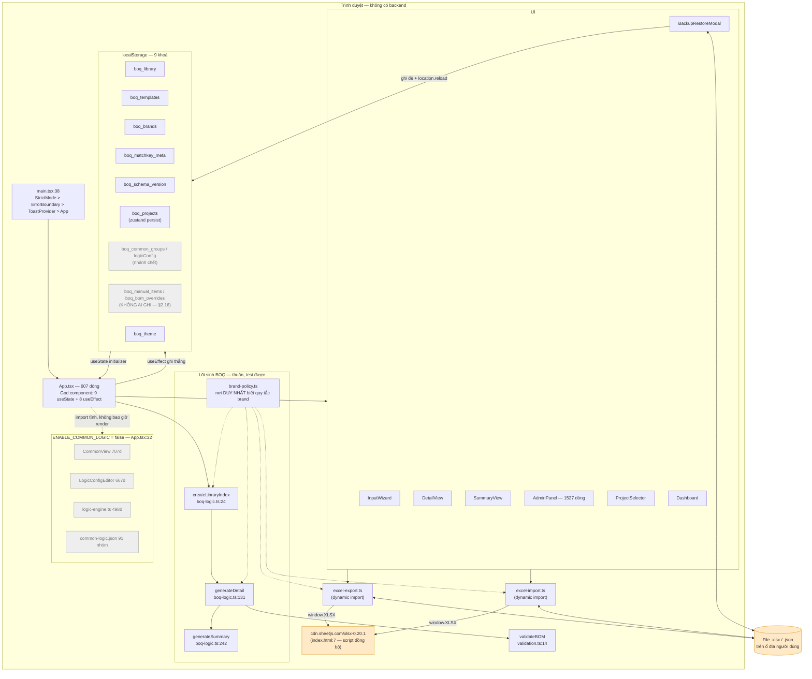
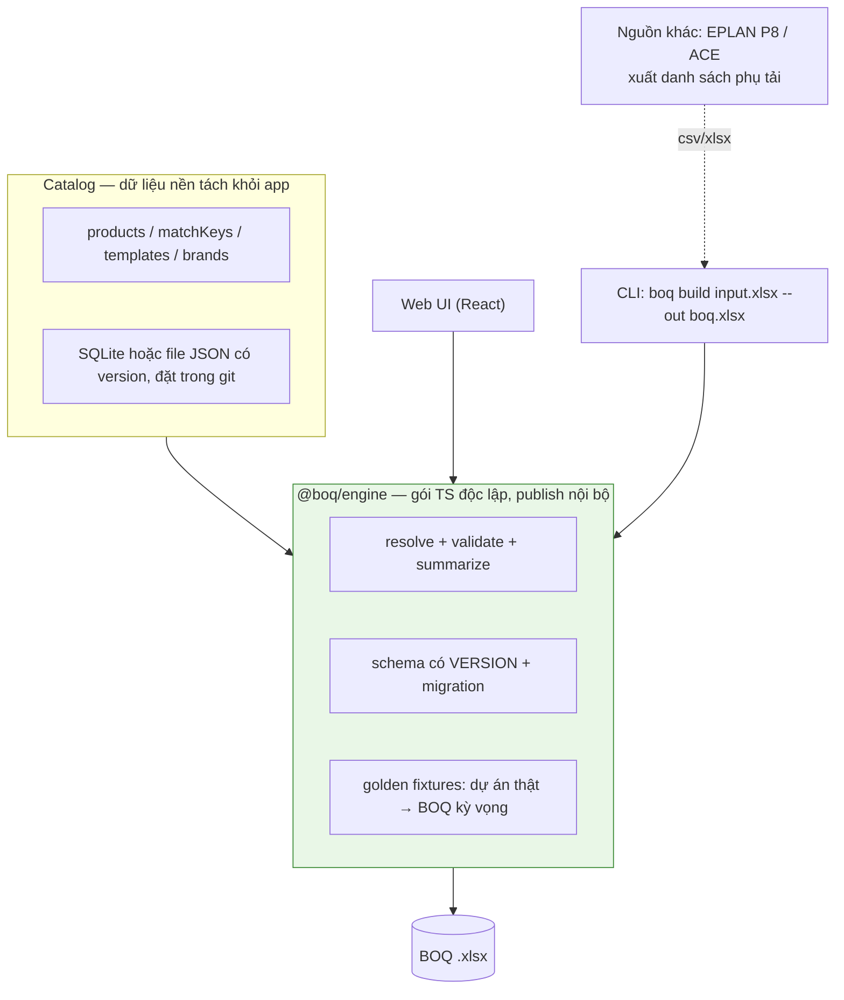

# BẢN ĐỒ LOGIC & ĐỀ XUẤT VIẾT LẠI — BOQ Generator

> **Ngày:** 12/09/2026 · **Phạm vi:** đọc-hiểu, KHÔNG sửa code, KHÔNG tạo file nguồn.
> **Cơ sở:** đọc trực tiếp toàn bộ `src/` (11.218 dòng TS/TSX), `package.json`, `vite.config.ts`,
> `index.html`, `.git`, `dist/`, và 2 tài liệu phân tích có sẵn trong repo.
> **Đã chạy thật trên máy:** `npx tsc -b` → **0 lỗi**. `npx vitest run` → **KHÔNG chạy được**
> (xem §6, Gap G1). Mọi `file:line` dưới đây đã đối chiếu trực tiếp.
>
> **Quy ước ghi chú:**
> `[Q]` = quan sát trực tiếp trong code · `[S]` = suy luận từ code · `[GĐ]` = giả định chưa xác nhận.

---

## 1. HIỆN TRẠNG

### 1.1 Mục đích hệ thống

Ứng dụng web một trang, chạy hoàn toàn trong trình duyệt, không backend. Người dùng khai báo danh
sách phụ tải (starter: loại, công suất, số lượng, nhãn hiệu, các tín hiệu phụ), hệ thống tra
**template định mức** theo `(type, power)` để nở thành danh sách vật tư, tra **thư viện sản phẩm**
theo `matchKey` (+ nhãn hiệu nếu món đó phụ thuộc nhãn hiệu) để lấy mã/mô tả/đơn vị thật, rồi xuất
bảng Chi tiết + Tổng hợp ra Excel. Toàn bộ dữ liệu nền (thư viện, template, nhãn hiệu, dự án) nằm
trong `localStorage` của đúng một trình duyệt trên đúng một máy.

### 1.2 Kiến trúc as-is



### 1.3 Stack, ranh giới, cách chạy

| Hạng mục | Thực tế đọc được | Nguồn |
|---|---|---|
| Ngôn ngữ / runtime | TypeScript 5.9 `strict: true`, React 19.2, ES2022, `verbatimModuleSyntax` | `package.json:11-19`, `tsconfig.app.json` |
| Build | Vite 7.2 · `npm run build` = `tsc -b && vite build` | `package.json:8` |
| Test | Vitest 4 + jsdom + Testing Library · `npm test` = `vitest run` | `package.json:11`, `vite.config.ts:8-12` |
| Lint | ESLint 9 flat config | `eslint.config.js` |
| State | **Hai hệ song song**: `useState` trong App (library/templates/brands/meta/starters) **và** zustand+persist (projects) | `App.tsx:54-95`, `stores/projectStore.ts:40` |
| Lưu trữ | `localStorage` — 9 khoá, không có IndexedDB, không có server | bảng §2.16 |
| Phụ thuộc ngoài lúc chạy | **1 và chỉ 1**: `cdn.sheetjs.com` (xlsx 0.20.1) tải đồng bộ trong `<head>` | `index.html:7` |
| Deploy | Không có Dockerfile / CI / script deploy. `dist/` build tay, mở bằng file tĩnh | không tìm thấy `.github/workflows`, `Dockerfile`, `compose` |
| Env / secrets | **Không có**. Không `.env`, không API key, không auth | `.gitignore:9-12` khai báo `.env` nhưng file không tồn tại |
| Ranh giới hệ thống | Trình duyệt ↔ ổ đĩa (File System Access API / download) ↔ CDN SheetJS. Hết. | — |

### 1.4 Trạng thái version control — **rủi ro vận hành số 1** `[Q]`

```
git ls-files          → 8 file
git log --oneline     → 7 commit, tất cả 17/06/2026, author "Antigravity"
git status            → 81 mục untracked
branch                → master (không remote)
```

8 file được git theo dõi: `App.tsx`, `BackupRestoreModal.tsx`, `excel-import.ts`,
`import-validation.ts` (+test), `logic-engine.ts` (+test), `storage-safety.test.ts`.

**Toàn bộ phần còn lại nằm ngoài git**: `boq-logic.ts` (lõi sinh BOQ), `brand-policy.ts`,
`excel-export.ts`, `validation.ts`, `AdminPanel.tsx`, `DetailView.tsx`, `InputWizard.tsx`,
`stores/`, `types/`, `data/`, và 9/12 file test. Nghĩa là **công sức tháng 9/2026 (brand model,
matchkey hygiene, vá pipeline) chỉ tồn tại dưới dạng file trên ổ đĩa**, trong thư mục tên
`boq-generator-main_20260824 - Copy`. Không có lịch sử, không có diff, không có đường lùi.
Chính `PLAN-BRAND-MODEL-2026-09-11.md §9.4` cũng đã ghi nhận việc này nhưng chưa làm.

### 1.5 Bảng tính năng

Liệt kê theo **entrypoint thật** (nút bấm / handler), không theo tên thư mục. Mã F dùng thống nhất với §2.

| # | Tên | Entry | File chính | Input → Output | Side effect | Rủi ro |
|---|---|---|---|---|---|---|
| F1 | Dựng chỉ mục thư viện | `useMemo` | `boq-logic.ts:24` | `Product[]`+`meta` → `LibraryIndex` | không | Hai bản đồ tie-break ngược nhau (D22) |
| F2 | Sinh BOQ chi tiết | `useMemo` | `boq-logic.ts:131` | starters+index+templates+meta → `BOMItem[]` | không | Thiếu template ⇒ im lặng (D2) |
| F3 | Gộp tổng hợp | `useMemo` | `boq-logic.ts:242` | `BOMItem[]` → `SummaryItem[]` | không | Bỏ `NOT_FOUND` ⇒ lệch Detail (D1) |
| F4 | Chính sách nhãn hiệu | gọi từ F1/F2 | `brand-policy.ts:97` | matchKey+meta → bool | không | Phân loại theo tiền tố tên |
| F5 | Thêm phụ tải thủ công | form | `InputWizard.tsx:130` | form → `StarterConfig` | `setStarters` | Chỉ cho chọn power có template (D25) |
| F6 | Sửa phụ tải / ghi đè KL | click trong bảng | `DetailView.tsx` + `App.tsx:289,303` | thao tác → starter/override | `setStarters`, `setBomQuantityOverrides` | Khoá override buộc vào id BOM (I3) |
| F7 | Vòng Excel phụ tải | 3 nút Input Wizard | `excel-import.ts:37` / `excel-export.ts:4` | `.xlsx` ↔ `StarterConfig[]` | thay/thêm starters | Cửa vào thứ hai, luật khác F5 (D25) |
| F8 | Thư viện sản phẩm | Admin → Products | `AdminPanel.tsx:111,147` | `.xlsx` → `Product[]` | ghi `boq_library` | Brand lạ ép về Schneider (D6) |
| F9 | Match Key Matrix | Admin → Match Keys | `excel-export.ts:370` / `excel-import.ts:315` | round-trip `.xlsx` | ghi library + meta | Đường an toàn nhất |
| F10 | Template định mức | Admin → Templates | `excel-import.ts:159,185` | `.xlsx` → template | ghi `boq_templates` | Vắng mặt = xoá **trong** một mức (I10) |
| F11 | Xuất BOQ | nút Export BOQ | `App.tsx:329` → `excel-export.ts:149` | bom+summary → `.xlsx` | ghi file | Tên dự án không tới nơi (D13) |
| F12 | Dự án & auto-save | ProjectSelector | `projectStore.ts:40`, `App.tsx:189-263` | CRUD | ghi `boq_projects` | 2 nguồn sự thật (D8) |
| F13 | Backup / Restore | nút Back-up | `BackupRestoreModal.tsx:12,78` | JSON ↔ localStorage | **ghi đè + reload** | Không hoàn tác (D10) |
| F14 | Validation + Dashboard | tự động / nút | `validation.ts:14`, `Dashboard.tsx:26` | bom+starters → issues, KPI | không | Cổng luôn mở (D14) |
| F15 | ~~Common Logic~~ | **không có entry** | `CommonView.tsx`, `logic-engine.ts` | — | — | Chết nhưng vẫn trong bundle |

---

## 2. LOGIC TỪNG TÍNH NĂNG

Mỗi mục gồm đủ 4 phần: **Tóm tắt · Sequence/flow · Bất biến · Nợ kỹ thuật gắn file**.
Bất biến đánh `I*`, nợ đánh `D*` — mã D được §4 và §5 tham chiếu lại.

---

### F1 — Dựng chỉ mục thư viện · `createLibraryIndex`

**Tóm tắt.** Biến mảng `Product[]` phẳng thành 5 bản đồ tra cứu để `generateDetail` không phải quét
tuyến tính. Sản phẩm không có `matchKey` bị loại ngay từ đầu nên **không bao giờ vào được BOQ** —
chúng chỉ tồn tại trong bảng Admin. Bản ghi "đại diện" cho mỗi matchKey được chọn bằng
`pickPreferredProduct` chứ không phải phần tử đầu mảng, để kết quả không đổi theo lịch sử import.
Hàm đồng thời phát hiện `conflicts`: matchKey không phụ thuộc nhãn hiệu mà lại có nhiều bản ghi —
dấu vết dữ liệu nhân bản do Import Matrix đời cũ để lại.

**Flow** (`boq-logic.ts:24-69`)

```
library.forEach ─┬─ !p.matchKey                    → bỏ qua hoàn toàn
                 ├─ p.brand  → byKeyAndBrand.set("key|brand", p)      ← GHI ĐÈ, phần tử SAU thắng
                 └─ byKeyAll.get(key).push(p)
byKeyAndBrand.forEach → byKeyAndBrandLoose.set(loose)                 ← if(!has), phần tử TRƯỚC thắng
byKeyAll.forEach ─┬─ pickPreferredProduct(products) → byKey, byKeyLoose
                  └─ products.length>1 && !isBrandSensitive(key) → conflicts.push(key)
```

**Bất biến**

- **I1** — `byKey` phải **tất định**: có `ibomCode` → brand A→Z → code A→Z → id A→Z
  (`brand-policy.ts:148-160`). Vỡ khi ai đó đổi lại thành `products[0]`. Phụ thuộc: `generateDetail`
  đường brand-agnostic (`:91`), `buildMatchKeyMatrixRows` (`excel-export.ts:382`).
- **I2** — Bản đồ `loose` **chỉ là lưới cứu hộ**, không bao giờ được tra trước bản đồ tuyệt đối
  (`:87`, `:91`). Đảo thứ tự ⇒ dữ liệu lệch hoa/thường im lặng khớp nhầm nhau.

**Nợ kỹ thuật**

| Mã | Vấn đề | File:line |
|---|---|---|
| **D22** | `byKeyAndBrand` dùng `.set()` (**phần tử sau thắng**) còn `byKeyAndBrandLoose` dùng `if(!has)` (**phần tử trước thắng**). Hai bản đồ của cùng một dữ liệu có luật phá hoà **ngược nhau**; trùng `matchKey|brand` thì đường tuyệt đối và đường cứu hộ trả về hai sản phẩm khác nhau. `[Q]` | `boq-logic.ts:34` vs `:50` |
| **D5** | `generateDetail` nhận `Product[] \| LibraryIndex` rồi rẽ nhánh bên trong; nhánh mảng (`findProduct`) giờ chỉ còn test dùng nhưng vẫn phải giữ đồng bộ hành vi bằng tay với nhánh index. | `boq-logic.ts:71-92`, `:141-143` |

---

### F2 — Sinh BOQ chi tiết · `generateDetail`

**Tóm tắt.** Tim của hệ thống. Với mỗi phụ tải, tra `templates[type][power]`; không có thì
`console.warn` rồi bỏ qua **im lặng với người dùng**. Mỗi dòng template đi qua bộ lọc `condition`
(chuỗi 9 nhánh `else if` đối chiếu `starter.signals`), rồi hỏi `isBrandSensitive` xem món đó có đi
theo nhãn hiệu người dùng chọn không. Không tìm thấy sản phẩm thì **vẫn sinh một dòng BOM giả**
mang `productCode: 'NOT_FOUND'` — tức là lỗi được biểu diễn bằng dữ liệu, không phải bằng exception.

**Flow** (`boq-logic.ts:131-240`)

```
foreach starter
 └─ templates[type][power] ──(undefined)──► console.warn + return   ⚠️ D2
    └─ foreach item
       ├─ xét condition: always | isolator | thermal | ptc | estop
       │                 | humidity | isolator_BFP | estop_BFP | isolator_estop_FB   (:156-174)
       │     └─ không khớp → bỏ dòng
       ├─ shouldRespectBrand = isBrandSensitive(item.matchKey, meta)             (:180)
       ├─ targetBrand = starter.brand
       │     └─ nếu condition==='isolator' HOẶC categoryOf()==='ISOLATOR'
       │            → targetBrand = starter.isolatorBrand                        (:187)
       ├─ respectBrand=true  → byKeyAndBrand → byKeyAndBrandLoose
       │  respectBrand=false → byKey        → byKeyLoose
       └─ thấy   → BOMItem{ id:`${starter.id}-${product.id}-${matchKey}`,
       │                    ibomCode: product.ibomCode || `IBOM-${product.code}`,
       │                    quantity: item.qty × starter.quantity }              (:202-214)
          không  → BOMItem{ id:`${starter.id}-missing-${matchKey}`,
                            productCode:'NOT_FOUND', description:`Missing ${key}`,
                            brand: respectBrand ? targetBrand : '—' }            (:221-234)
```

**Bất biến**

- **I3** — `id` BOM = `` `${starterId}-${productId}-${matchKey}` `` hoặc `` `${starterId}-missing-${matchKey}` ``.
  `bomQuantityOverrides` khoá **theo chính id này** (`App.tsx:274`) và `handleDeleteStarter` dọn
  override bằng tiền tố `` `${starterId}-` `` (`App.tsx:321`). **Đổi công thức id = mất toàn bộ ghi
  đè khối lượng của mọi dự án đã lưu, im lặng.** Phụ thuộc: `App.tsx:274,303-313,321`, `DetailView.tsx:361,383`.
- **I4** — `quantity = item.qty × starter.quantity`, nhân đúng **một lần**, không tầng nào nhân lại.
- **I5** — Mỗi dòng template qua được `condition` sinh **đúng một** dòng BOM (thật hoặc NOT_FOUND).
  Không có đường "biến mất không dấu vết" — trừ khi cả mức template không tồn tại (D2).
- **I6** — Isolator nhận `isolatorBrand` qua **hai** cửa: `condition==='isolator'` **hoặc**
  `categoryOf()==='ISOLATOR'` (`:187`). Bỏ vế thứ hai là tái sinh lỗi M4 cũ
  (`'ISOLATOR_16A'.startsWith('ISO_') === false`).

**Nợ kỹ thuật**

| Mã | Vấn đề | File:line | Mức |
|---|---|---|---|
| **D2** | Mức `(type,power)` thiếu template ⇒ phụ tải sinh **0 vật tư**, chỉ có `console.warn`. `validateBOM` chỉ báo khi BOM **rỗng hoàn toàn** nên trường hợp "1 trong 20 phụ tải mất hút" không ai thấy. | `boq-logic.ts:149`, `validation.ts:37` | **Cao** |
| **D3** | Chuỗi 9 `else if` là bảng tra trá hình. Thêm một tín hiệu phải sửa **6 nơi**: union `ComponentCondition` (`types/index.ts:60`), `StarterConfig.signals` (`:24-32`), `generateDetail` (`:156-174`), `VALID_CONDITIONS` (`template-validation.ts:43`), form InputWizard, cột Excel (`excel-export.ts:27-33`). | 6 điểm | Trung bình |
| **D4** | Một mức template **có thể chứa 2 dòng cùng `matchKey`** khác `condition` — `AdminPanel.tsx:237` và `excel-import.ts:217` đều `push` không kiểm trùng. Khi đó 2 `BOMItem` có **id trùng** ⇒ trùng React key (`DetailView.tsx:363`), một entry override áp cho **cả hai**, và `handleSaveQtyEdit` chỉ sửa được dòng đầu. `[S]` — template mặc định chưa có trùng. | `boq-logic.ts:203`, `AdminPanel.tsx:280` | Trung bình |

---

### F3 — Gộp tổng hợp · `generateSummary`

**Tóm tắt.** Gộp BOM chi tiết thành bảng tổng hợp bằng một `Map`. Hai bộ lọc chạy trước:
bỏ mọi dòng `NOT_FOUND` và mọi dòng `quantity <= 0`. Khoá gộp ưu tiên `ibomCode`, rơi về
`productCode`, cuối cùng rơi về `NO_CODE_<description>` — thứ tự này có lý do: một `productCode`
(mã khung breaker) có thể dùng chung cho nhiều biến thể chỉ khác nhau ở `ibomCode`, gộp theo
`productCode` sẽ nhập nhầm hai vật tư khác nhau làm một.

**Flow** (`boq-logic.ts:242-275`)

```
foreach bom item
 ├─ productCode === 'NOT_FOUND' → bỏ                                   (:246)  ⚠️ D1
 ├─ quantity <= 0               → bỏ  (đây là ngữ nghĩa "đã xoá")      (:247)
 ├─ key = (ibomCode && ibomCode!=='N/A') ? ibomCode
 │        : productCode ? productCode
 │        : `NO_CODE_${description}`                                    (:254-256)
 └─ có key → totalQuantity += quantity
    chưa   → tạo dòng mới, lấy brand/unit/description của bản gặp ĐẦU TIÊN
```

**Bất biến**

- **I7** — `ibomCode` là **khoá gộp**. Mọi đường ghi dữ liệu phải giữ `ibomCode` **riêng theo từng
  brand**; làm phẳng nó giữa các brand ⇒ hai vật tư khác nhau nhập làm một dòng tổng hợp. Đây chính
  là lý do `excel-import.ts:409-418` có 3 tầng ưu tiên iBom và `excel-export.ts:398` phải có cột
  `<Brand>_iBomCode`.
- **I8** — `quantity <= 0` **là** cách biểu đạt "người dùng đã xoá dòng này", không phải dữ liệu
  rác. `DetailView.tsx:456` xoá bằng cách đặt override = 0. Nếu ai đó "dọn" bộ lọc này thì các dòng
  đã xoá quay lại bảng tổng hợp.
- **I9** — Dòng tổng hợp lấy `brand/unit/description` của bản ghi **gặp đầu tiên**; các bản sau chỉ
  cộng số lượng. Hai bản ghi cùng `ibomCode` khác mô tả ⇒ một mô tả bị nuốt im lặng.

**Nợ kỹ thuật**

| Mã | Vấn đề | File:line | Mức |
|---|---|---|---|
| **D1** | `NOT_FOUND` **bị loại khỏi Summary** nhưng **vẫn vào sheet Detail** khi xuất (`exportToExcel` chỉ lọc `quantity > 0`). ⇒ hai sheet trong cùng một file **không cân nhau**, và file giao khách có dòng ghi chữ `NOT_FOUND`. Xuất vẫn được vì thiếu sản phẩm chỉ là `warning` (D14). | `boq-logic.ts:246` vs `excel-export.ts:193` | **Cao** |
| **D23** | Sản phẩm có **cả `code` lẫn `ibomCode` rỗng** nhận `ibomCode = 'IBOM-'` từ `generateDetail:206`; chuỗi này không rỗng và khác `'N/A'` nên thành khoá gộp hợp lệ ⇒ **mọi** sản phẩm như vậy dồn vào **một dòng tổng hợp duy nhất**. `[S]` — library mẫu chưa dính vì MCT/PCT tuy `code:''` nhưng đều có `ibomCode`. | `boq-logic.ts:206` + `:254` | Trung bình |

---

### F4 — Chính sách nhãn hiệu · `brand-policy.ts`

**Tóm tắt.** Module sạch nhất repo: 166 dòng, thuần, không đụng React/DOM, có 16 test thật. Nó là
**nơi duy nhất** trong repo biết quy tắc "matchKey nào đi theo nhãn hiệu người dùng chọn". Quy tắc
nghiệp vụ chốt 11/09/2026: chỉ **CB / contactor / relay nhiệt / isolator**; mọi thứ khác giữ brand
của bản ghi trong thư viện (MCT/PCT luôn OMEGA, VFD giữ brand library). Phân loại lấy từ `meta`
nếu có khai báo, không có thì suy từ **tiền tố tên matchKey**.

**Flow**

```
isBrandSensitive(key, meta)                                   (:97-101)
 ├─ typeof meta[key].brandSensitive === 'boolean' → trả thẳng      ← NGUỒN SỰ THẬT
 └─ ngược lại → inferCategory(key) ∈ BRAND_SENSITIVE_CATEGORIES

inferCategory(key)                                            (:76-86)
 └─ upper(trim(key)) khớp CATEGORY_PREFIXES theo THỨ TỰ MẢNG:
    CONTACTOR → THERMAL → ISOLATOR → BREAKER → DRIVE → CT → CABLE → ACCESSORY → OTHER

normalizeMatchKey(key)  : NBSP/zero-width → space, trim       (:61-65)   ← dùng khi GHI
looseMatchKey(key)      : normalize + UPPER                   (:68-70)   ← dùng khi CỨU
```

**Bất biến**

- **I10** — `meta[key].brandSensitive` thắng mọi suy luận; `category` chỉ để gợi ý + hiển thị Admin
  (`types/index.ts:75-81`). `meta` rỗng ⇒ rơi về suy luận ⇒ **mọi caller cũ giữ nguyên hành vi**.
  Đây là thứ khiến cờ `ENABLE_BRAND_POLICY` (`App.tsx:37`) rollback được tức thì.
- **I11** — `CATEGORY_PREFIXES` **phụ thuộc thứ tự**: `MCCB_`/`MCB_` phải đứng trước `CB_`, và
  `ISOLATOR_` là tiền tố **khác** `ISO_` (`:44-46`). Đảo thứ tự mảng = đổi phân loại hàng loạt.
- **I12** — Mọi đường **ghi** matchKey phải đi qua `normalizeMatchKey` (`AdminPanel.tsx:506`,
  `excel-import.ts:194,338`). Bỏ sót một đường ⇒ dữ liệu dính khoảng trắng quay lại và BOQ báo
  `Missing` trong khi Admin vẫn hiện key đó rành rành.

**Nợ kỹ thuật**

| Mã | Vấn đề | File:line | Mức |
|---|---|---|---|
| **D29** | Phân loại thiết bị dựa trên **quy ước đặt tên chuỗi do người dùng gõ tay**. Một key tên `CB tổng 100A` rơi vào `OTHER` ⇒ không theo brand, không có chỗ nào cảnh báo. Không có validator tên matchKey lúc tạo. | `brand-policy.ts:76-86`, `AdminPanel.tsx:504` | Trung bình |
| — | `LEGACY_SWITCHING_PREFIXES` (`:32-34`) giữ lại **chỉ để test hồi quy đối chiếu**, không dùng trong đường chạy — có comment nói rõ. Đây là nợ **cố ý và được tài liệu hoá**, không tính là defect. | `brand-policy.ts:31-34` | — |

---

### F5 — Thêm phụ tải thủ công · Input Wizard

**Tóm tắt.** Form đơn giản sinh một `StarterConfig` với `crypto.randomUUID()`. Điểm đáng chú ý về
mặt logic: danh sách **Starter Type** và **Power** không phải hằng số mà **suy ra từ `templates`
đang có** — `Object.keys(templates)` và `Object.keys(templates[type])`. Nghĩa là UI **không cho
phép** tạo một phụ tải không có template. `isolatorBrand` chỉ được gán khi `isolator` bật.

**Flow** (`InputWizard.tsx:17-146`)

```
availableTypes  = Object.keys(templates) || ['DOL','Star-Delta','VFD','Soft-Starter']   (:21-23)
availablePowers = Object.keys(templates[type]).map(Number).sort() || [0.18]             (:44-47)
useEffect[type] → nếu power hiện tại không nằm trong availablePowers → ép về phần tử [0] (:52-56)
handleSubmit → StarterConfig{ id: crypto.randomUUID(), type, power, quantity, brand,
                              isolatorBrand: isolator ? isolatorBrand : undefined,
                              signals, loadName: trim() || undefined }                  (:130-146)
             → onAddStarter → App.setStarters(prev => [...prev, s])                     (App.tsx:285)
```

**Bất biến**

- **I13** — Phụ tải tạo từ UI **luôn** có template tương ứng (`:44-56`). Đây là bất biến **chỉ đúng
  ở cửa vào này**; cửa Excel (F7) không giữ nó — xem D25.
- **I14** — `isolatorBrand` là `undefined` khi `isolator === false` (`:139`). `generateDetail:187`
  dựa vào điều này: `starter.isolatorBrand` falsy ⇒ isolator lấy brand chính.
- **I15** — `loadName` rỗng được chuẩn hoá thành `undefined`, không phải `''` (`:141`). `validateBOM:47`
  và `sanitizeStarter:118` đều dựa vào phân biệt này.

**Nợ kỹ thuật**

| Mã | Vấn đề | File:line | Mức |
|---|---|---|---|
| **D28** | `brand` và `isolatorBrand` khởi tạo bằng `useState(brands[0] ?? 'Schneider')` — **initializer chỉ chạy một lần**. Người dùng thêm nhãn hiệu mới trong Admin thì giá trị mặc định của form không cập nhật cho tới khi remount. `[S]` | `InputWizard.tsx:29,31` | Thấp |
| **D30** | `import { useEffect as React_useEffect }` (`:1`) khai báo nhưng **không dùng**; file dùng `React.useEffect` từ `import * as React` (`:2`, `:52`). Hai kiểu import React lẫn lộn trong một file. | `InputWizard.tsx:1-2` | Thấp |

---

### F6 — Sửa phụ tải & ghi đè khối lượng · Detail View

**Tóm tắt.** Bảng Detail vừa hiển thị vừa là bề mặt chỉnh sửa: đổi brand/tín hiệu của phụ tải, sửa
tên tải, sửa **khối lượng từng dòng vật tư**, xoá dòng, xoá cả phụ tải. Điều quan trọng về kiến
trúc: sửa khối lượng **không** sửa BOM (BOM là derived state, tính lại mỗi render) mà ghi vào một
bản đồ ghi đè riêng `bomQuantityOverrides` khoá theo id BOM. "Xoá một linh kiện" cũng chính là ghi
đè về 0 — không có thao tác xoá thật.

**Flow**

```
đổi brand / tín hiệu → onUpdateStarter(id, patch)
      → App.setStarters(map)  (App.tsx:289)  → bom tính lại từ đầu qua useMemo (App.tsx:266)

sửa KL dòng BOM  → onUpdateBomItemQuantity(item.id, n)  (DetailView.tsx:406,424)
      → App.setBomQuantityOverrides({...prev, [id]: n})  (App.tsx:303-313)
      → bomWithOverrides = bom.map(i => overrides[i.id] ?? i.quantity)  (App.tsx:272-278)

xoá dòng  → onUpdateBomItemQuantity(id, 0)     (DetailView.tsx:456)  → qty 0 ⇒ rơi khỏi Summary + Excel
khôi phục → onUpdateBomItemQuantity(id, undefined) → delete overrides[id]  (App.tsx:306-308)
xoá phụ tải → setStarters(filter) + xoá mọi override có tiền tố `${id}-`  (App.tsx:315-327)
sửa KL dòng manual → onUpdateManualItemQuantity; qty<=0 ⇒ XOÁ HẲN khỏi manualItems  (App.tsx:293-301)
```

**Bất biến**

- **I16** — BOM **là derived state**, không bao giờ được lưu. Mọi chỉnh tay phải đi qua
  `bomQuantityOverrides` (dòng tự sinh) hoặc `manualItems` (dòng thêm tay). Vỡ bất biến này là
  nguyên nhân kinh điển của "sửa xong, đổi brand một cái là mất".
- **I17** — Hai họ dòng có **ngữ nghĩa xoá khác nhau**: dòng tự sinh xoá = đặt override 0 (vẫn còn
  trong mảng, `DetailView.tsx:456`); dòng manual xoá = **biến mất khỏi mảng** (`App.tsx:295`).
  Cùng một nút 🗑️ trên UI, hai hành vi khác nhau.
- **I18** — Dọn override khi xoá phụ tải dựa vào việc id BOM **bắt đầu bằng** `` `${starterId}-` ``
  (`App.tsx:321`). An toàn vì `starterId` là UUID, nhưng ràng buộc này **không được test nào giữ**.

**Nợ kỹ thuật**

| Mã | Vấn đề | File:line | Mức |
|---|---|---|---|
| **D31** | Override **không bao giờ được dọn** khi lý do tồn tại của nó biến mất theo cách khác: đổi brand phụ tải ⇒ `product.id` đổi ⇒ id BOM đổi ⇒ override cũ thành **rác vĩnh viễn** trong `boq_projects`, còn dòng mới quay về khối lượng mặc định **không báo gì**. `[S]` — hệ quả trực tiếp của I3 + I16. | `App.tsx:274,303`, `boq-logic.ts:203` | **Cao** |
| **D32** | `useEffect[starters]` mở lại **toàn bộ** panel mỗi khi mảng `starters` đổi tham chiếu (`DetailView.tsx:34-41`) — tức là mỗi lần gõ một ký tự vào tên tải. Trạng thái đóng/mở của người dùng bị reset liên tục. | `DetailView.tsx:34-41` | Thấp |
| **D33** | `FALLBACK_BRANDS` hard-code 4 brand vẫn còn ở `:23` như lưới an toàn khi prop `brands` rỗng — di tích của lỗi M10 đã sửa. Một nguồn brand thứ ba ngoài `brands` và `allBrands`. | `DetailView.tsx:23,26` | Thấp |

---

### F7 — Vòng Excel cho danh sách phụ tải

**Tóm tắt.** Ba nút "Xuất Input / Nhập Input / File mẫu" ở đầu thẻ Input Wizard. Ba hàm phía sau đã
tồn tại từ lâu nhưng **không nút nào gọi** cho tới đợt sửa 11/09 — `PIPELINE §1.1` gọi đây là "3 hàm
chết". Đường nhập dùng **whitelist động**: starter type lấy từ template đang có, brand lấy từ danh
sách brand động, nên không ép nhầm về `DOL`/`Schneider` như bản mặc định. Nhập mặc định là THÊM;
THAY THẾ bắt gõ đúng chữ `REPLACE`.

**Flow** (`InputWizard.tsx:60-128` → `excel-import.ts:37-71` → `import-validation.ts:85-131`)

```
Xuất  : starters → {Type,Power,Quantity,LoadName,Description,Brand,Isolator,IsolatorBrand,7 tín hiệu}
        → showSaveFilePicker || XLSX.writeFile                      (excel-export.ts:4-72)

Nhập  : FileReader → XLSX.read → sheet_to_json
        → sanitizeStarter(row, availableTypes, brands) cho từng dòng
             ├─ type  : matchAllowed(raw, allowedTypes) ?? 'DOL'          (:92-96)
             ├─ brand : matchAllowed(raw, allowedBrands) ?? 'Schneider'   (:98-99)
             ├─ power : Math.max(0.18, Number(raw))                       (:104)
             ├─ qty   : isNaN||<=0 ? 1 : Math.max(1, round(n))            (:106-107)
             ├─ loadName : LoadName ?? Description, trim                   (:110)
             └─ signals  : 7 cột, 'Yes' hoặc true                          (:121-129)
        → CẢNH BÁO các mức chưa có template                                (InputWizard.tsx:97-102)
        → confirm THÊM/THAY THẾ → nếu THAY THẾ: prompt gõ 'REPLACE'        (:104-119)
        → onImportStarters(imported, mode)  → App.tsx:360
```

**Bất biến**

- **I19** — `sanitizeStarter` **luôn** trả về một `StarterConfig` hợp lệ, không bao giờ ném lỗi và
  không bao giờ trả `null`. Dữ liệu rác được **ép về mặc định** chứ không bị loại. Hệ quả: một file
  sai toàn tập vẫn nhập "thành công" với N dòng DOL 0.18kW Schneider.
- **I20** — Whitelist brand/type là **hàng rào chống injection** từ file Excel không tin cậy
  (`import-validation.ts:4-5`, test có case XSS). Bỏ whitelist để "giữ brand lạ" là gỡ hàng rào.
- **I21** — `id` luôn sinh mới bằng `crypto.randomUUID()` khi nhập (`:113`). Nhập lại cùng một file
  ⇒ **phụ tải nhân đôi**, không có khoá ổn định để nhận ra trùng.

**Nợ kỹ thuật**

| Mã | Vấn đề | File:line | Mức |
|---|---|---|---|
| **D25** | **Hai cửa vào cùng một thực thể, hai luật khác nhau.** UI không cho tạo phụ tải thiếu template (I13); Excel thì cho, chỉ cảnh báo. Dòng nhập vào sẽ sinh 0 vật tư và im lặng mãi về sau (D2). | `InputWizard.tsx:44-56` vs `:97-102` | Trung bình |
| **D6** | Brand không nằm trong whitelist bị **ép về `'Schneider'`**, chỉ có `console.warn`. Nếu người dùng vừa bấm Clear Data rồi nhập file cũ thì `library` rỗng ⇒ OMEGA rơi khỏi whitelist ⇒ **toàn bộ hàng OMEGA im lặng thành Schneider**. Test `legacy-data-import.test.ts:52` đã **đóng băng** hành vi này với tiêu đề có dấu ⚠️ — biết mà chưa sửa. | `import-validation.ts:55-58` | **Cao** |
| **D39** | Ngữ nghĩa nhập là "THÊM hoặc THAY TOÀN BỘ" (`App.tsx:360-362`) — không có upsert theo khoá, không có xoá tường minh. Đúng vấn đề P2 mà `PIPELINE §1.2` đã nêu. | `App.tsx:360` | Trung bình |

---

### F8 — Thư viện sản phẩm · Admin → Products

**Tóm tắt.** CRUD trực tiếp trên `Product[]` cộng một vòng Excel. Gộp theo khoá
`` `${matchKey || code}|${brand}` `` chứ không theo `code` đơn thuần — vì `code` là mã khung có thể
dùng chung cho nhiều biến thể, gộp theo code đơn thuần từng ghi đè mất biến thể. Nhập mặc định là
GỘP; THAY THẾ bắt gõ `REPLACE`. Brand **không còn bắt buộc** với matchKey không phụ thuộc nhãn hiệu.

**Flow**

```
Lưu tay   : brandRequired = !matchKey || isBrandSensitive(matchKey, meta)   (AdminPanel.tsx:114)
            thiếu code → return im lặng; thiếu brand khi bắt buộc → return im lặng  (:115-116)
            có id → map thay thế; không → push                              (:123-127)

Nhập Excel: importLibraryFromExcel(file, allowedBrands = brands ∪ library.brand)  (:154-157)
            → sanitizeProduct mỗi dòng
            → confirm: OK = GỘP theo keyOf | Cancel = REPLACE (prompt 'REPLACE')   (:160-190)
            → GỘP: Map(library).set(key, {...existing, ...item})            (:168-177)

Xuất Excel: {ID,Code,iBomCode,Description,Brand,Unit,Price,MatchKey}        (excel-export.ts:81-90)
```

**Bất biến**

- **I22** — Khoá gộp thư viện là `` `${matchKey || code}|${brand}` ``, **giống hệt** ở hai nơi:
  `App.handleImportToLibrary` (`App.tsx:371`) và `AdminPanel.handleImportLibrary` (`:168`). Hai bản
  sao của cùng một quy tắc — lệch nhau là dữ liệu lệch nhau.
- **I23** — Sản phẩm **không có `matchKey`** hợp lệ và lưu được, nhưng `createLibraryIndex` bỏ qua
  chúng (`boq-logic.ts:30`) ⇒ **không bao giờ vào BOQ**. Không có cảnh báo nào nói điều đó.

**Nợ kỹ thuật**

| Mã | Vấn đề | File:line | Mức |
|---|---|---|---|
| **D34** | `handleSaveProduct` `return` **im lặng** khi thiếu `code` hoặc thiếu brand bắt buộc — người dùng bấm Save, không có gì xảy ra, không có thông báo. | `AdminPanel.tsx:115-116` | Trung bình |
| **D35** | Quy tắc gộp thư viện viết **hai lần** ở hai file. | `App.tsx:371` và `AdminPanel.tsx:168` | Trung bình |
| **D36** | `handleAddComponent` đọc giá trị form bằng `document.getElementById(...).value` thay vì state React — 4 lần trong một hàm. | `AdminPanel.tsx:205-208` | Trung bình |

---

### F9 — Match Key Matrix · Admin → Match Keys

**Tóm tắt.** Đường dữ liệu **an toàn nhất** trong repo và cũng là đường được đầu tư kỹ nhất: một
sheet, mỗi dòng một matchKey, cột brand **động** (không hard-code 4 brand), có cột `BrandSensitive`
và cột `<Brand>_iBomCode` riêng cho từng hãng. Import là **merge, không bao giờ xoá**: ô bị xoá
trắng chỉ được liệt kê trong `report.cleared`. Ô brand được tính là "có dữ liệu" nếu có `code`
**hoặc** `ibomCode` — vì 20/28 vật tư thật (toàn bộ MCT/PCT) có `code` rỗng.

**Flow** (`excel-export.ts:358-403` ↔ `excel-import.ts:315-445`)

```
XUẤT: matrixBrands = (brands || 4 mặc định) ∪ mọi brand có trong library      (:358-362)
      mỗi key → refProduct = pickPreferredProduct(products)    ← TẤT ĐỊNH, không phải [0]
               → {MatchKey, Description, Unit, iBomCode, BrandSensitive,
                  <B>_Code, <B>_iBomCode cho từng brand}                       (:384-399)

NHẬP: chuẩn hoá tên cột (bỏ trắng + lower)                                     (:331-334)
      matchKey = normalizeMatchKey(...)   → rỗng thì skipped++                 (:338,343)
      cột BrandSensitive có → ghi vào nextMeta; không có → giữ meta cũ / suy luận  (:346-355)
      filled = các ô brand có code HOẶC ibom                                   (:369-375)
      ô có cột nhưng trống mà library đang có → report.cleared (KHÔNG xoá)     (:377-388)
      targets = brandSensitive ? filled : filled.slice(0,1)  + report.conflicts (:390-398)
      với mỗi target: nextIbom = perBrandIbom || existing.ibomCode || sharedFallback (:409-418)
      → trả {library, meta, report} → AdminPanel confirm rồi mới ghi           (AdminPanel.tsx:1069-1076)
```

**Bất biến**

- **I24** — **Không bao giờ xoá bản ghi** từ đường nhập này. Ô trống = báo cáo, không phải lệnh xoá
  (`:377-388`).
- **I25** — matchKey **không** phụ thuộc nhãn hiệu chỉ được có **đúng 1** bản ghi (`:391`). Vi phạm
  bất biến này chính là `conflicts` mà `createLibraryIndex` phát hiện và Toast cảnh báo
  (`App.tsx:173-183`).
- **I26** — Thứ tự ưu tiên `ibomCode`: **cột riêng theo brand → giá trị đang có trong thư viện →
  cột dùng chung (chỉ với file mẫu cũ)** (`:409-418`). Đảo thứ tự là tái sinh lỗi M7 — làm phẳng
  iBom giữa các brand, mà iBom là khoá gộp của Summary (I7).
- **I27** — Ô brand tính theo `code` **hoặc** `ibom`; chỉ xét `code` là làm biến mất toàn bộ MCT/PCT
  (`:369-375`, có comment giải thích).

**Nợ kỹ thuật**

| Mã | Vấn đề | File:line | Mức |
|---|---|---|---|
| **D37** | `report` giàu thông tin (added/updated/conflicts/cleared/skipped) nhưng **cửa quyết định vẫn là một `confirm()`** với 6 con số; danh sách `cleared` và `conflicts` chỉ xem được **sau khi đã ghi**. Đúng vấn đề P5 "không có dry-run" của `PIPELINE §1.2`. | `AdminPanel.tsx:1062-1076` | Trung bình |
| **D38** | Nút **Clear Data** xoá mọi sản phẩm có matchKey; có cảnh báo brand mồ côi và bắt gõ `CLEAR`, nhưng **không có snapshot** — kết hợp với D6 tạo thành đường mất OMEGA kinh điển: Clear → import file cũ → tất cả thành Schneider. | `AdminPanel.tsx:1085-1112` | **Cao** |

---

### F10 — Template định mức · Admin → Templates

**Tóm tắt.** Template là cấu trúc lồng ba tầng `type → power → component[]`, lưu nguyên hình dạng đó
trong `localStorage`. Vòng Excel làm phẳng ra 5 cột rồi dựng lại. Đợt vá 11/09 đổi ngữ nghĩa nhập từ
**REPLACE toàn bộ** sang **MERGE theo từng mức `(type, power)`** và thêm kiểm tra `condition` —
trước đó gõ sai `themal` thì linh kiện im lặng biến mất khỏi BOQ mãi mãi.

**Flow** (`excel-import.ts:159-227`, `AdminPanel.tsx:630-680`)

```
parseTemplateRows(rows)
 ├─ thiếu type|power|matchKey            → report.skipped++, bỏ dòng          (:196)
 ├─ qty NaN/<=0                          → về 1 + report.fixedQuantities      (:198-201)
 ├─ normalizeCondition(raw)
 │     ├─ rỗng → 'always'                                    (template-validation.ts:50)
 │     ├─ khớp VALID_CONDITIONS (không phân biệt hoa/thường) → giá trị chuẩn
 │     └─ không khớp → undefined → report.invalidConditions  ← CHẶN CẢ LẦN NHẬP (:205-213)
 └─ templates[type][power].push({matchKey, qty, condition})                   (:215-217)

AdminPanel: invalidConditions.length > 0 → alert liệt kê SỐ DÒNG Excel, return, KHÔNG ghi gì
            tiers.length === 0           → alert, return
            → confirm nêu rõ "cập nhật N mức / GIỮ NGUYÊN M mức" (untouchedTiers)
            → onUpdateTemplates(mergeTemplates(templates, incoming))
```

**Bất biến**

- **I28** — **Vắng mặt ≠ xoá ở cấp MỨC, nhưng vắng mặt = xoá ở cấp LINH KIỆN trong một mức.**
  Hai ngữ nghĩa ngược nhau trong cùng một hàm, có comment giải thích (`excel-import.ts:151-157`)
  nhưng người cầm file Excel không nhìn thấy comment.
- **I29** — `VALID_CONDITIONS` là **một danh sách duy nhất** dùng chung cho cả JSON editor và đường
  Excel (`template-validation.ts:43`, export ra ngoài có chủ đích). Tách đôi trở lại là tái sinh
  lỗi P0-1/P3.
- **I30** — `mergeTemplates` **không đột biến** đối tượng gốc (`:160-168`, có test
  `template-import.test.ts:104`).
- **I31** — Nhãn hiển thị trên UI (`Iso/Estop FB`) **khác** giá trị hợp lệ trong Excel
  (`isolator_estop_FB`). Ai copy nhãn UI vào cột Condition sẽ bị chặn — đã có thông báo rõ.

**Nợ kỹ thuật**

| Mã | Vấn đề | File:line | Mức |
|---|---|---|---|
| **D40** | `handleSaveTemplate` (JSON editor) **thay toàn bộ** `templates[type]` bằng nội dung editor — tức là trong cùng một Admin có **hai ngữ nghĩa ghi khác nhau** cho template: Excel thì merge theo mức, JSON editor thì replace cả type. | `AdminPanel.tsx:338-358` | Trung bình |
| **D41** | `handleSaveQtyEdit` và các handler khác **đột biến tại chỗ**: `newTemplates[type][power][i].qty = ...` sau khi chỉ sao chép nông `{...templates}` ⇒ sửa thẳng vào object trong state cũ. Hiện không lộ bug vì React re-render theo tham chiếu tầng ngoài, nhưng là bẫy chờ. | `AdminPanel.tsx:278-284` | Trung bình |
| **D42** | `useEffect[allPowerKeys]` chỉ `setCollapsedPowers(prev => new Set(prev))` với comment "Validating logic placeholder" — effect **không làm gì** ngoài việc tạo Set mới mỗi lần templates đổi. | `AdminPanel.tsx:90-96` | Thấp |

---

### F11 — Xuất BOQ ra Excel

**Tóm tắt.** Nút Export mở cổng validation trước, rồi mở modal chọn định dạng (full / summary_only /
detail_only), chọn cột, tick metadata. `exportToExcel` dựng workbook 1–3 sheet, dịch tên cột sang
tiếng Việt bằng một chuỗi ternary lồng, sắp xếp Summary theo mô tả với collator `'vi'`, rồi lưu qua
File System Access API và rơi về `XLSX.writeFile` nếu không có.

**Flow**

```
handleExportExcel (App.tsx:329)
 ├─ shouldBlockExport(validation) → chỉ chặn khi có ERROR                     (validation.ts:119)
 └─ setShowExportModal(true)
        └─ handleExportWithOptions(options)                                   (App.tsx:342)
             ├─ hasWarnings → toast "Xuất với N cảnh báo" NHƯNG VẪN XUẤT      (:344-346)
             ├─ await import('./utils/excel-export')      ← code splitting
             └─ exportToExcel(bomWithOverrides, summary, options)
                  ├─ sheet "Project Info" nếu includeMetadata && (name||author||desc)  (:171) ⚠️ D13
                  ├─ sheet "Detail"  : lọc quantity > 0, map tên cột VN        (:189-213)
                  ├─ sheet "Summary" : sort localeCompare(vi) + đánh STT       (:216-240)
                  └─ filename = projectName.replace(/[^a-zA-Z0-9]/g,'_') || 'BOQ_Export'  (:243-252)
```

**Bất biến**

- **I32** — Dữ liệu xuất là `bomWithOverrides`, **không phải** `bom` (`App.tsx:350`). Xuất từ `bom`
  là mất toàn bộ chỉnh tay của người dùng.
- **I33** — Sheet Detail lọc `quantity > 0` — cùng ngữ nghĩa "đã xoá" với I8 nhưng **không** lọc
  `NOT_FOUND` như Summary. Đây chính là chỗ hai sheet tách nhau (D1).
- **I34** — `exportToExcel` trả `false` khi người dùng bấm Cancel ở hộp lưu file (`AbortError`), và
  `true` khi ghi xong — nhưng `handleExportWithOptions` **bỏ qua giá trị trả về** và luôn báo
  "Export successful!" (`App.tsx:351`).

**Nợ kỹ thuật**

| Mã | Vấn đề | File:line | Mức |
|---|---|---|---|
| **D13** | `App.tsx:587-593` render `ExportOptionsModal` **không truyền** `projectName`/`projectDescription` dù modal khai props đó và nhét vào `ExportOptions`. Hệ quả kép: sheet "Project Info" **không bao giờ được tạo** dù ô tick mặc định bật (`ExportOptionsModal.tsx:67`), và tên file **luôn** là `BOQ_Export.xlsx`. Dữ liệu có sẵn qua `useCurrentProject()`. | `App.tsx:587`, `excel-export.ts:171,243` | **Cao** |
| **D43** | Huỷ hộp thoại lưu file vẫn hiện toast "Export successful!" vì giá trị trả về bị bỏ. | `App.tsx:350-351`, `excel-export.ts:274` | Thấp |
| **D7** | 10 lần gọi `showSaveFilePicker` trong 5 hàm + 4 khối `FileReader` chép nguyên văn + **22 `@ts-ignore`** giữa hai file. Đổi hành vi lưu file phải sửa 6 chỗ. | `excel-export.ts`, `excel-import.ts` | Trung bình |
| **D44** | Dịch tên cột bằng ternary lồng 8 tầng, viết **hai lần** (Detail và Summary) thay vì một bản đồ. | `excel-export.ts:198-206`, `:227-234` | Thấp |

---

### F12 — Dự án & auto-save

**Tóm tắt.** Đường phức tạp nhất về mặt **thời gian**, không phải về thuật toán. Dự án lưu bằng
zustand + persist vào khoá `boq_projects`; nhưng App lại **đọc thẳng khoá đó bằng tay** lúc mount.
Auto-save có debounce 1 giây và **ba lớp guard** để không ghi rỗng đè dữ liệu thật, cộng một
`beforeunload` bù cho khoảng trễ. Đáng chú ý về nghiệp vụ: tạo dự án mới **cuốn theo công việc đang
làm** chứ không dọn bàn.

**Flow** (`App.tsx:189-263`, `projectStore.ts`, `ProjectSelector.tsx`)

```
MOUNT  : đọc localStorage['boq_projects'] → parsed.state || parsed
         → tìm project theo currentProjectId → setStarters/manualItems/overrides   (:189-207)
ARM    : setTimeout(0) → hasLoadedRef = true   ← KHÔNG set đồng bộ, nếu không effect
                                                 auto-save chạy cùng lượt flush với state rỗng (:215-218)
SAVE   : payload = useMemo({starters, manualItems, overrides})
         → useDebounce(payload, 1000)
         → guard1 hasLoadedRef · guard3 currentProjectId · guard2 so sánh JSON.stringify
         → syncToCurrentProject(...)  → bump metadata.updatedAt                    (:227-245)
UNLOAD : so sánh lại 3 trường bằng JSON.stringify → dirty ⇒ chặn đóng tab          (:248-263)

Tạo dự án  : createProject(name) → currentProjectId = mới
             → syncToCurrentProject(starters HIỆN TẠI)   ← "Save As" ngầm  (ProjectSelector.tsx:50-60)
Nạp dự án  : lưu dự án đang mở trước → loadProject → onLoadProject(...)   (:62-73)
Dự án mới  : lưu trước → setCurrentProject(null) → onLoadProject([],[],{})(:88-96)
```

**Bất biến**

- **I35** — Auto-save **chỉ được phép chạy sau khi auto-load xong**; `setTimeout(0)` là cơ chế giữ
  bất biến này. Đổi thành `hasLoadedRef.current = true` đồng bộ ⇒ effect auto-save chạy ngay trong
  cùng lượt flush với state còn rỗng ⇒ **ghi rỗng đè dự án đang có dữ liệu** (comment `:212-214`).
- **I36** — Không có `currentProjectId` thì **không ghi gì** (`:231`). Đây là lý do "Dự án mới" an toàn.
- **I37** — `syncToCurrentProject` luôn bump `metadata.updatedAt` (`projectStore.ts:134`); guard2 so
  sánh nội dung trước khi gọi để không bump vô ích.
- **I38** — `partialize` chỉ persist `projects` + `currentProjectId` (`projectStore.ts:146-149`).
  Thêm trường vào store mà quên `partialize` ⇒ trường đó không bao giờ được lưu.

**Nợ kỹ thuật**

| Mã | Vấn đề | File:line | Mức |
|---|---|---|---|
| **D8** | **Hai nguồn sự thật cho cùng một khoá.** `App.tsx:193-194` bóc `parsed.state` — tức là phụ thuộc vào **hình dạng phong bì nội bộ của zustand persist**. Nâng cấp zustand đổi định dạng serialize ⇒ app khởi động với `starters` rỗng, **không một lỗi nào**, người dùng tưởng mất dự án. | `App.tsx:190-207` vs `projectStore.ts:143` | **Cao** |
| **D26** | Tạo dự án mới **cuốn theo công việc hiện tại** (`ProjectSelector.tsx:53-54`) — ngữ nghĩa "Save As" nhưng nút ghi "Tạo dự án". Người dùng nghĩ mình bắt đầu trắng thì thực ra vừa nhân bản. `[S]` | `ProjectSelector.tsx:50-60` | Trung bình |
| **D9** | So sánh trạng thái bằng `JSON.stringify` — 3 lần mỗi tick debounce, 3 lần mỗi `beforeunload`. Đúng kết quả (cùng hình dạng object ⇒ cùng thứ tự khoá) nhưng O(n) trên toàn payload. | `App.tsx:236-238`, `:256-258` | Thấp |
| **D45** | `updateProject` (`projectStore.ts:81`) **không có caller nào** trong `src/`. API store rộng hơn thực dùng. | `projectStore.ts:81-96` | Thấp |

---

### F13 — Backup / Restore

**Tóm tắt.** Gom 10 khoá localStorage vào một JSON có `version` và `exportDate`, lưu file. Nhập thì
validate schema (chống JSON hỏng / injection) rồi **ghi đè thẳng** từng khoá và
`window.location.reload()`. Đây là **đường lùi duy nhất** của toàn hệ thống, và bản thân nó
**không có đường lùi**.

**Flow** (`BackupRestoreModal.tsx:12-118`, `import-validation.ts:21-46`)

```
XUẤT : {exportDate, version:'1.0', data:{ commonGroups, logicConfig, library, templates,
        brands, matchKeyMeta, schemaVersion, projects, manualItems, bomOverrides }}
       ← mỗi trường là CHUỖI JSON thô lấy thẳng từ localStorage.getItem            (:14-30)

NHẬP : file.text() → JSON.parse
       → validateBackupJSON: version là string? data là object?
         mỗi khoá trong 9 khoá nếu có mặt phải là STRING và JSON.parse được,
         + kiểm kiểu: library/brands là mảng, templates/matchKeyMeta là object    (import-validation.ts:21-46)
       → setItem từng khoá (chỉ khi truthy)                                       (:98-107)
       → alert + window.location.reload()                                         (:109-110)
```

**Bất biến**

- **I39** — Backup lưu **chuỗi JSON thô**, không phải object đã parse. Đổi sang lưu object là phá
  vỡ `validateBackupJSON` (nó kiểm `typeof data[key] !== 'string'`) và phá mọi file backup cũ.
- **I40** — Restore **chỉ ghi khoá có giá trị truthy** (`if (backup.data.X)`). Hệ quả: backup từ
  máy chưa có `matchKeyMeta` sẽ **không xoá** meta đang có trên máy đích ⇒ restore là **merge một
  phần**, không phải thay thế sạch như tên gọi và như cảnh báo trên UI nói.

**Nợ kỹ thuật**

| Mã | Vấn đề | File:line | Mức |
|---|---|---|---|
| **D10** | **Không snapshot, không hoàn tác.** Restore nhầm file = mất trắng công việc đang làm. Mục số 1 trong danh sách "còn lại" của `PIPELINE §6.4`. | `BackupRestoreModal.tsx:98-110` | **Cao** |
| **D11** | Hai trường **backup ma**: `boq_manual_items` và `boq_bom_overrides` được đọc lúc xuất và ghi lúc nhập, nhưng grep toàn `src/` cho thấy **không dòng nào ghi hai khoá này** — dữ liệu thật nằm trong `boq_projects`. Backup luôn chứa `null`, restore luôn set một khoá không ai đọc. | `BackupRestoreModal.tsx:27,28,106,107` | Trung bình |
| **D12** | `boq_theme` **không** nằm trong backup ⇒ khôi phục xong mất giao diện tối. Danh sách khoá được liệt kê **bằng tay ở 2 nơi**, không có nguồn chung. | `BackupRestoreModal.tsx:17-29` vs `useTheme.ts:16` | Thấp |
| **D46** | `onImport` prop được khai báo và truyền vào (`App.tsx:582`) với thân hàm rỗng `{/* handled in modal */}` — API giả. | `BackupRestoreModal.tsx:6`, `App.tsx:582` | Thấp |

---

### F14 — Validation & Dashboard

**Tóm tắt.** `validateBOM` chạy mỗi khi BOM đổi, sinh 3 rổ `errors/warnings/infos`. Nó chỉ tạo
**đúng một loại error**: BOM rỗng trong khi có starter. Mọi vấn đề thực tế — thiếu sản phẩm, trùng
cấu hình, thiếu tên tải — đều là warning hoặc info. Dashboard tính KPI và một "health score" tuyến
tính từ số issue.

**Flow**

```
validateBOM(bomWithOverrides, starters)                              (validation.ts:14)
 ├─ mỗi item productCode==='NOT_FOUND'      → WARNING                (:23-34)
 ├─ bom rỗng && starters.length>0           → ERROR   ← loại error DUY NHẤT (:37-44)
 ├─ starter không có loadName               → INFO    (gộp 1 dòng)   (:47-55)
 └─ trùng (type-power-brand) VÀ ít nhất 2 cái trùng luôn loadName → WARNING (:58-83)

shouldBlockExport(result, blockOnWarnings=false) → chỉ chặn khi !isValid (:115-121)

Dashboard.stats                                                       (Dashboard.tsx:26-85)
 ├─ totalStarters = Σ starter.quantity          ← đúng: cộng số lượng, không đếm cấu hình
 ├─ totalItems    = bom.length                  ← đếm CẢ NOT_FOUND và dòng qty=0
 ├─ distributionData = theo type, màu xoay vòng 8 màu
 └─ healthScore   = totalStarters>0 ? max(0, 100 - issueCount*5) : 100
```

**Bất biến**

- **I41** — `isValid === (errors.length === 0)`; warning **không bao giờ** chặn xuất trừ khi caller
  truyền `blockOnWarnings` — và **không caller nào truyền** (`App.tsx:331`).
- **I42** — Validation chạy trên `bomWithOverrides` chứ không phải `bom` (`App.tsx:283`), nên dòng
  người dùng đã xoá (override 0) vẫn bị đếm là NOT_FOUND nếu nó là dòng thiếu. `[S]`

**Nợ kỹ thuật**

| Mã | Vấn đề | File:line | Mức |
|---|---|---|---|
| **D14** | **Cổng chất lượng gần như luôn mở.** BOQ có 200 dòng `NOT_FOUND` vẫn xuất bình thường, chỉ hiện toast "Xuất với N cảnh báo". Cộng với D1 và D2, đây là đường ngắn nhất dẫn tới một file BOQ sai được gửi đi. | `validation.ts:26,119`, `App.tsx:331,344` | **Cao** |
| **D24** | KPI "Total Items" = `bom.length` đếm cả dòng `NOT_FOUND` lẫn dòng đã xoá (qty=0) ⇒ **báo cáo cao hơn thực tế**. `healthScore` = 100 khi chưa có phụ tải nào — dự án rỗng hiện "hoàn hảo". | `Dashboard.tsx:29,72-74` | Trung bình |
| **D27** | Cảnh báo trùng phụ tải **chỉ bật khi có ít nhất 2 cái trùng cả `loadName`** (`:69-74`); phụ tải trùng cấu hình mà **không đặt tên tải** — trường hợp phổ biến nhất — không bao giờ được cảnh báo. | `validation.ts:69-74` | Thấp |
| **D47** | `countIssues` (`:97`) không có caller nào. | `validation.ts:97-109` | Thấp |

---

### F15 — Common Logic (nhánh chết)

**Tóm tắt.** Một hệ luật phụ thuộc riêng: 91 nhóm thiết bị, các luật `SAME_RATING` / `SAME_SIZE` /
`SIZE_MAPPING`, lan truyền chọn tự động theo BFS có giới hạn độ sâu 10, và một bộ tính số lượng 8
nguồn (`FIXED`, `FRAME_QTY`, `PANEL_QTY`, `DEPENDENT`, `MATCH_SIZE`, `MATCH_SIZE_PHASE_SPLIT`…).
Đây là phần thuật toán **phức tạp nhất repo** — và nó **không chạy**: `ENABLE_COMMON_LOGIC = false`.

**Flow** (`logic-engine.ts:127-428` — chỉ để tài liệu hoá, không có đường tới)

```
evaluateAutoSelection(triggerGroup, isSelecting, selection, groups, config, productOverride)
 └─ BFS queue, depth < 10
    └─ với mỗi rule đang bật có mainGroup = nhóm hiện tại
       ├─ isSelecting=false → xoá nhóm phụ thuộc + mọi item của nó, đẩy con vào queue
       └─ isSelecting=true  → với mỗi source item đang chọn:
             rating = match /(\d+)\s*A\b/ trên description
             ├─ SAME_RATING  → regex ranh giới số  (?:^|[^0-9])<rating>/   ← chống 10A khớp 210A
             ├─ SAME_SIZE    → isSizeMatch(desc, targetSize)               ← chống 10x20 khớp 10x200
             └─ SIZE_MAPPING → tra bảng mappings[key]; với mỗi cột:
                   ├─ cột pha  → 3 nhóm màu đỏ/vàng/xanh
                   │     ├─ co nhiệt: base=⌊qty/3⌋, dư chia theo idx < remainder
                   │     └─ busbar  : round(qty/3)
                   ├─ cột neutral → nhóm đen, qty nguyên
                   └─ cột earth   → co nhiệt BỎ QUA; busbar lấy nguyên
```

**Bất biến**

- **I43** — Tổng số lượng co nhiệt sau khi chia 3 pha phải **bằng đúng** `qty` gốc — thuật toán
  `base + (idx < remainder ? 1 : 0)` (`:349-370`) tồn tại chính vì điều này. Có test kiểm ngẫu
  nhiên… nhưng là test trên **bản chép** (D15).
- **I44** — Mọi so khớp số (rating, kích thước) phải dùng **regex ranh giới số**, không dùng
  `.includes` (`:19-33`, `:207`). Đây là lỗi cũ đã sửa, dễ tái phát.

**Nợ kỹ thuật**

| Mã | Vấn đề | File:line | Mức |
|---|---|---|---|
| **D15** | **Bộ test lớn nhất repo không test code sản phẩm.** `logic-engine.test.ts` (193 dòng, ~30 test) **không `import` gì** từ `./logic-engine`; nó chép `isSizeMatch` (`:10-20`), `distributeHeatShrinkQty` (`:78-86` — hàm **không tồn tại** trong code sản phẩm), `testRatingMatch` (`:151-154`), `sanitizeQty` (`:179-182`) vào chính file test rồi test bản chép. Sửa `logic-engine.ts` thế nào 30 test này vẫn xanh. Con số "142/142" ở `PIPELINE §6.3` vì thế **không phản ánh đúng độ phủ**. | `logic-engine.test.ts` toàn file | **Cao** |
| **D48** | Nhánh chết vẫn `import` **tĩnh** ⇒ `CommonView` (707d) + `LogicConfigEditor` (667d) + `logic-engine` (498d) + `common-logic.json` (63KB, 91 nhóm) + `logic-config.json` (4KB) nằm nguyên trong `index-*.js`. | `App.tsx:16`, `:32`, `:530` | Trung bình |
| **D18** (xem §2.17) | 14 lần `console.log` / `[DEBUG]` trong đường chạy của `logic-engine.ts`, in mọi phép so khớp màu và kích thước. | `logic-engine.ts` | Thấp |
| **D49** | `processCommonLogic` (`common-logic.ts:11`) là placeholder: `SELECT_ONE` và `DEPENDENT` trả mảng rỗng, có comment "Placeholder for logic processing". Không có caller. | `common-logic.ts:11-28` | Thấp |

---

### 2.16 Kiểm kê localStorage (cắt ngang F1–F15)

| Khoá | Ai ghi | Ai đọc | Trong backup? | Kết luận |
|---|---|---|---|---|
| `boq_library` | `App.tsx:109` | `App.tsx:56` | ✔ | ok |
| `boq_templates` | `App.tsx:116` | `App.tsx:66` | ✔ | ok |
| `boq_brands` | `App.tsx:123` | `App.tsx:76` | ✔ | ok — `allBrands` **cố ý** không ghi ngược (`App.tsx:157-160`) |
| `boq_matchkey_meta` | `App.tsx:130` | `App.tsx:87` | ✔ | ok |
| `boq_schema_version` | `App.tsx:143` | `App.tsx:139` | ✔ | ok — migration một lần, `=2` |
| `boq_projects` | zustand persist | zustand **+ `App.tsx:190` đọc tay** | ✔ | **D8** |
| `boq_theme` | `useTheme.ts:16` | `useTheme.ts:7` | ✘ | **D12** |
| `boq_common_groups` | `CommonView.tsx:30` | `CommonView.tsx:23` | ✔ | nhánh chết |
| `logicConfig` | `CommonView.tsx` ×4 | `CommonView.tsx:36` | ✔ | nhánh chết |
| `boq_manual_items` | **không ai** | **không ai** | ✔ | **D11 — khoá ma** |
| `boq_bom_overrides` | **không ai** | **không ai** | ✔ | **D11 — khoá ma** |

### 2.17 Nợ ngang (cắt qua nhiều tính năng)

| Mã | Vấn đề | Số liệu |
|---|---|---|
| **D16** | **`confirm`/`prompt`/`alert` làm luồng nghiệp vụ.** Mọi quyết định phá hoại dữ liệu đi qua hộp thoại native, nội dung nghiệp vụ nhúng trong chuỗi template giữa JSX. Không test tự động được, không hiện diff được, không i18n được. | **43 lần** trong 8 component; `AdminPanel.tsx` **16 lần** |
| **D17** | **God component.** `AdminPanel.tsx` 1527 dòng (3 tab + Brand Manager + modal report + JSON editor). `App.tsx` 607 dòng giữ 9 `useState` + 8 `useEffect`, truyền 9 prop xuống AdminPanel và 9 prop xuống DetailView. | 3.508 dòng trong 4 file |
| **D18** | **Log là `console.*`.** Không mức log, không tắt được ở production, không cách nào truy lại một lần import đã làm gì sau khi tab đóng. | `logic-engine.ts` 14 · `App.tsx` 8 · `excel-import.ts` 7 |
| **D19** | **xlsx hai phiên bản song song.** `index.html:7` nạp **0.20.1** từ CDN; `package.json:18` khai **0.18.5**. Runtime dùng `window.XLSX \|\| await import('xlsx')` ⇒ thường chạy 0.20.1, mất mạng rơi về 0.18.5 (chunk 429KB). **Đường fallback chưa từng được test.** | 10 điểm gọi |
| **D20** | **Phụ thuộc CDN cứng, không có SRI hash.** Thẻ `<script>` đồng bộ trong `<head>` chặn render nếu CDN chậm. | `index.html:7` |
| **D21** | ESLint **88 lỗi** — nhưng báo cáo đề ngày 02/02/2026, **cũ hơn toàn bộ thay đổi tháng 9**. `[GĐ]`, cần chạy lại. | `eslint-report.json` |

---

## 3. SKILL CẦN BỔ SUNG CHO MỤC 4 & 5

**Trả lời thẳng: CÓ — bắt buộc 2, tuỳ chọn 2.**

Lý do không phải "cho đẹp": repo này đã có **hai tài liệu phân tích chất lượng cao**
(`PLAN-BRAND-MODEL`, `PIPELINE-EXPORT-IMPORT`) do agent viết, nhưng cả hai đều kết thúc bằng một
mục "việc còn phải làm" mà **không ai làm tiếp**, và cả hai đều khẳng định các con số nghiệm thu
(`142/142 pass`) mà **một phần trong đó là test rỗng** (§2 F15, D15). Đó là triệu chứng của việc
mỗi phiên agent phải tự dựng lại bản đồ từ đầu, tự chọn cách trình bày, và không có ràng buộc
bắt buộc phải chứng minh. Skill là chỗ đóng đinh 3 thứ đó.

Mượn từ GBrain đúng 3 ý, không hơn: **provenance** (mọi khẳng định phải có nguồn),
**citation `file:line`** (không có dòng thì không được viết), **gap analysis** (bắt buộc kê khai
phần chưa đọc — "não chưa biết gì"). Không lấy kiến trúc memory của GBrain.

---

### SKILL 1 — `repo-logic-map` · **BẮT BUỘC**

````markdown
---
name: repo-logic-map
description: Dựng bản đồ một codebase theo ĐỒ THỊ RUNTIME (entrypoint → layer → storage → side effect), không theo cây thư mục. Dùng khi cần hiểu hệ thống trước khi sửa/viết lại, khi onboard repo lạ, hoặc khi cần trả lời "cái gì thực sự chạy".
---

# repo-logic-map

## Khi nào agent PHẢI load

- Yêu cầu chứa: "đọc codebase", "bản đồ", "hiểu hệ thống", "trước khi viết lại", "audit", "onboard".
- Trước BẤT KỲ đề xuất kiến trúc nào. Không được đề xuất khi chưa có bản đồ.
- KHÔNG load cho: sửa một hàm đã biết vị trí, viết test cho file đã đọc.

## Input bắt buộc

| Tên | Bắt buộc | Mô tả |
|---|---|---|
| `repo_root` | ✔ | Đường dẫn tuyệt đối |
| `budget_files` | ✔ | Trần số file được đọc. Hết trần thì DỪNG và kê khai, không đọc lén thêm |
| `entry_hints` | ✘ | Gợi ý entrypoint nếu người dùng biết |

## Quy trình

### B0 — Định vị (KHÔNG đọc source)
1. Đọc: README, manifest (`package.json`/`pyproject.toml`/`go.mod`), lockfile, `Dockerfile`,
   compose, CI config, file cấu hình build/test/lint.
2. Ghi: ngôn ngữ, runtime, lệnh chạy/build/test, env & secret, ranh giới hệ thống.
3. **Chạy `git ls-files | wc -l` và `git log --oneline | head`.** Nếu số file tracked lệch nhiều
   so với số file thật trên đĩa ⇒ ghi ngay vào Gap, mức `CRITICAL`. Repo không có version control
   thật thì MỌI đề xuất sau đó phải bắt đầu bằng việc khôi phục nó.
4. Chạy typecheck + test + lint nếu có. **Ghi kết quả thật, kể cả khi không chạy được** — lý do
   không chạy được là dữ liệu, không phải thất bại.

### B1 — Tìm entrypoint THẬT
Không suy từ tên thư mục. Chỉ chấp nhận entrypoint nếu truy được từ một trong các nguồn:
manifest `scripts`/`main`, HTML `<script>`, route/router table, CLI arg parser, worker/cron
registration, test bootstrap, hoặc `__main__`.
> Một thư mục tên `features/` không chứng minh có feature nào. Một nút `onClick` thì có.

### B2 — Dựng đồ thị runtime
Với mỗi entrypoint, đi xuôi: `trigger → orchestration → domain → I/O → side effect`.
Mỗi cạnh phải kèm `file:line`. Không đi được tiếp thì dừng và ghi Gap.

### B3 — Chấm cờ chết (bắt buộc, không bỏ qua)
1. Tìm mọi cờ hằng `ENABLE_*` / `FEATURE_*` / hằng boolean module-level. Đánh giá điều kiện render
   /gọi **theo logic thật**, không theo tên cờ.
2. Với mỗi nhánh không bao giờ chạy được: xác định nó có bị `import` tĩnh không. Nếu có, **đo kích
   thước nó kéo vào bundle/binary**.
3. Với mỗi module chết: kiểm tra file test tương ứng có `import` module đó không.
   **Test không import code sản phẩm = test rỗng**, phải báo mức `CRITICAL`.

### B4 — Kiểm kê trạng thái bền vững
Liệt kê MỌI khoá lưu trữ (localStorage/DB table/file). Với mỗi khoá, grep đủ 3 cột:
**ai ghi / ai đọc / có trong backup không**. Khoá ghi mà không ai đọc, hoặc đọc mà không ai ghi,
đều là defect phải báo.

### B5 — Gap analysis (KHÔNG được bỏ)
Kê khai: file chưa đọc + lý do; khẳng định chưa chứng minh được; câu hỏi phải hỏi người dùng.
Bản đồ không có mục Gap = bản đồ không hợp lệ.

## Output contract

```json
{
  "repo": {"root":"","languages":[],"run":"","build":"","test":"","test_result":"","vcs":{"tracked_files":0,"untracked":0,"last_commit":"","risk":"ok|critical"}},
  "entrypoints": [{"name":"","file":"","line":0,"kind":"http|cli|ui|worker|cron","evidence":"file:line"}],
  "features": [{"id":"F1","name":"","entry":"file:line","core":"file:line","input":"","output":"","side_effects":[],"reachable":true,"risks":[]}],
  "runtime_edges": [{"from":"file:line","to":"file:line","kind":"call|render|persist|network|dynamic-import"}],
  "state_keys": [{"key":"","written_by":["file:line"],"read_by":["file:line"],"in_backup":true,"verdict":"ok|orphan-write|orphan-read|phantom"}],
  "dead_code": [{"module":"","reason":"","flag":"file:line","statically_imported":true,"weight":"LOC|KB"}],
  "hollow_tests": [{"test_file":"","claims_to_test":"","imports_production":false}],
  "invariants": [{"id":"I1","statement":"","evidence":"file:line","breaks_if":""}],
  "debt": [{"id":"D1","problem":"","evidence":["file:line"],"impact":"cao|trung bình|thấp","pain":"bug|chi phí|độ phức tạp|vận hành|mở rộng"}],
  "gaps": [{"unread":"","why":"","question_for_user":""}]
}
```

## Guardrail

- **CẤM** khẳng định một path/hàm/dependency chưa mở ra đọc. Chưa đọc ⇒ `gaps`, không ⇒ `features`.
- **CẤM** mọi chỉnh sửa code khi đang map. Chỉ đọc. Kể cả sửa lỗi chính tả.
- **BẮT BUỘC** `file:line` cho mọi phần tử của `features`, `runtime_edges`, `invariants`, `debt`.
  Không có citation thì xoá dòng đó.
- **BẮT BUỘC** phân biệt `[Q] quan sát` / `[S] suy luận` / `[GĐ] giả định`. Trộn ba loại là lỗi nặng.
- **CẤM** đề xuất refactor trong output của skill này. Map và đề xuất là hai bước tách rời.
- Nếu kết quả test là số liệu cũ đọc từ file artifact (`test-results.json`…), **phải ghi ngày của
  artifact** và đánh dấu `[GĐ]`.

## Vì sao là skill, không phải prompt dài

1. **Ép thứ tự.** Prompt dài không ngăn agent nhảy sang đề xuất kiến trúc ở file thứ ba. Skill có
   B0→B5 và guardrail "cấm đề xuất khi đang map" biến thứ tự thành ràng buộc.
2. **Output là dữ liệu, không phải văn.** JSON schema cho phép phiên sau `diff` bản đồ cũ với bản
   đồ mới để biết cái gì đã đổi — văn xuôi thì không. Đây là điều kiện để pipeline nhiều phiên
   cộng dồn thay vì làm lại.
3. **B3/B4 là thứ không ai tự nghĩ ra.** Hai bước này bắt được đúng ba defect nặng nhất của repo
   này (test rỗng, khoá backup ma, 1.900 dòng code chết trong bundle) — không phải vì agent giỏi
   hơn mà vì có checklist bắt phải nhìn.
4. **Chi phí giảm dần.** Bản đồ lần sau chỉ cần cập nhật delta, không đọc lại từ đầu.
````

---

### SKILL 2 — `feature-trace` · **BẮT BUỘC**

````markdown
---
name: feature-trace
description: Truy vết MỘT tính năng từ entrypoint tới storage/side effect cuối cùng, liệt kê happy path, nhánh lỗi, bất biến và điểm gãy. Dùng trước khi sửa/viết lại một tính năng, khi điều tra bug, hoặc khi cần chứng minh "đổi chỗ này thì hỏng chỗ nào".
---

# feature-trace

## Khi nào agent PHẢI load

- Trước khi sửa logic của một tính năng đã tồn tại.
- Khi điều tra bug mà triệu chứng và nguyên nhân ở hai file khác nhau.
- Khi cần trả lời "đổi X thì hỏng gì".
- Yêu cầu `repo-logic-map` đã chạy, hoặc entrypoint được người dùng chỉ đích danh.

## Input bắt buộc

| Tên | Bắt buộc | Mô tả |
|---|---|---|
| `feature_id` hoặc `entry` | ✔ | ID từ bản đồ, hoặc `file:line` của entrypoint |
| `depth_limit` | ✔ | Số tầng gọi tối đa. Chạm trần ⇒ ghi Gap, không đoán tiếp |
| `sample_input` | ✘ | Dữ liệu thật để đối chiếu — nếu có, chất lượng trace tăng rõ rệt |

## Quy trình

1. **Chốt biên.** Ghi rõ tính năng bắt đầu ở đâu, kết thúc ở đâu (dòng ghi storage / dòng gọi
   mạng / dòng ghi file). Không có điểm kết thúc tường minh thì chưa được trace.
2. **Happy path.** Liệt kê tuần tự `file:function:line` từ entry tới điểm kết. Mỗi bước 1 câu:
   biến đổi gì. Cấm mô tả "xử lý dữ liệu".
3. **Nhánh phụ.** Với mỗi `if`/`catch`/`early return` trên đường: nhánh đó dẫn tới đâu, người dùng
   **thấy gì**. Nhánh chỉ `console.*` rồi `return` ⇒ đánh dấu `SILENT_FAILURE`, mức cao.
4. **Ma trận điều kiện.** Nếu có cờ/điều kiện/`condition` quyết định phần tử nào được tính: lập
   bảng điều kiện × kết quả. Đếm số nơi phải sửa khi thêm một giá trị mới — con số đó là chi phí
   mở rộng, phải đưa vào output.
5. **Bất biến.** Nêu các mệnh đề phải luôn đúng để tính năng chạy (công thức khoá, thứ tự mảng,
   ngữ nghĩa vắng mặt, đơn vị đo). Mỗi bất biến kèm **"vỡ khi nào"** và **"ai còn phụ thuộc"**.
6. **Retry / timeout / idempotency / authz.** Tính năng không có phần nào thì ghi `N/A — lý do`,
   **không được bỏ trống** — "không có retry" cũng là một phát hiện.
7. **Điểm gãy.** Duplication, coupling, dead branch, so sánh chuỗi thay vì kiểu, ghi đè không hoàn tác.

## Output contract

```json
{
  "feature": {"id":"","name":"","entry":"file:line","terminates_at":["file:line"]},
  "happy_path": [{"step":1,"at":"file:fn:line","does":""}],
  "branches": [{"at":"file:line","condition":"","leads_to":"","user_sees":"","verdict":"ok|SILENT_FAILURE|DATA_LOSS"}],
  "condition_matrix": {"dimensions":[],"rows":[],"edit_points_to_add_one":0},
  "data_model": [{"type":"","shape":"","key_formula":"","at":"file:line"}],
  "invariants": [{"id":"","statement":"","evidence":"file:line","breaks_if":"","depended_on_by":["file:line"]}],
  "resilience": {"retry":"","timeout":"","idempotency":"","authz":""},
  "fragile_points": [{"what":"","evidence":["file:line"],"kind":"duplication|coupling|dead|stringly-typed|irreversible","impact":""}],
  "gaps": []
}
```

## Guardrail

- **CẤM** viết một bước happy path mà không mở file đọc dòng đó.
- **CẤM** sửa code trong lúc trace — kể cả khi thấy bug rõ ràng. Bug ghi vào `fragile_points`.
- **BẮT BUỘC** mọi `invariants` có `breaks_if` và `depended_on_by`. Bất biến không nêu được ai phụ
  thuộc thì chưa phải bất biến, chỉ là mô tả.
- **BẮT BUỘC** `resilience` đủ 4 trường, dùng `N/A — lý do` khi không có.
- Gặp `confirm()`/`alert()`/`prompt()` trên đường chạy: ghi là **điểm quyết định nghiệp vụ không
  test được**, không bỏ qua vì "chỉ là UI".

## Vì sao là skill, không phải prompt dài

1. **Bước 5 là thứ quyết định viết lại có an toàn không.** Bất biến kiểu "id BOM = `starterId-productId-matchKey`
   và override khoá theo nó" chỉ lộ ra khi có ô bắt buộc phải điền. Không có ô đó, agent viết lại
   sẽ đổi công thức id và làm mất toàn bộ override của người dùng — im lặng.
2. **Bước 3 biến `console.warn` thành phát hiện.** Mặc định agent coi `console.warn + return` là
   "đã xử lý lỗi". Nhãn `SILENT_FAILURE` ép nó thành một dòng trong báo cáo.
3. **`edit_points_to_add_one` là số đo độ cứng, không phải cảm nhận.** "Thêm một tín hiệu phải sửa
   6 chỗ" thuyết phục hơn "code hơi coupling", và nó so sánh được giữa các phương án kiến trúc.
4. **Kết quả ghép được vào pipeline.** Nhiều `feature-trace` + một `repo-logic-map` = đủ đầu vào
   cho `architecture-decision` mà không phải đọc lại repo.
````

---

### SKILL 3 — `architecture-decision` · **BẮT BUỘC**

````markdown
---
name: architecture-decision
description: So sánh các phương án kiến trúc DỰA TRÊN ràng buộc đã đo được của chính repo này, không dựa trên best practice chung. Dùng khi quyết định viết lại, đổi storage, tách service, chọn thư viện, hoặc khi cần một ADR có đường lùi.
---

# architecture-decision

## Khi nào agent PHẢI load

- Người dùng hỏi "có nên viết lại / đổi kiến trúc / chọn A hay B".
- Sau `repo-logic-map` (+ `feature-trace` cho các tính năng liên quan). **Không được chạy trước.**
- KHÔNG load cho: chọn tên biến, chọn thư viện tiện ích không ảnh hưởng ranh giới.

## Input bắt buộc

| Tên | Bắt buộc | Mô tả |
|---|---|---|
| `map` | ✔ | Output của `repo-logic-map` |
| `traces` | ✔ | Output `feature-trace` của các tính năng bị ảnh hưởng |
| `pains` | ✔ | Danh sách pain THẬT, mỗi pain kèm bằng chứng. Pain kiểu "code xấu" bị loại |
| `constraints` | ✔ | Ràng buộc bất biến: số người dùng, offline?, dữ liệu ở đâu, ai vận hành, ngân sách thời gian |
| `reversibility_budget` | ✔ | Chấp nhận mất bao lâu nếu chọn sai |

## Quy trình

1. **Lọc pain.** Mỗi pain phải ánh xạ tới ≥1 `debt` hoặc `fragile_point` có `file:line`.
   Pain không có bằng chứng ⇒ loại, ghi vào `rejected_pains`. **Không bao giờ đề xuất đổi kiến trúc
   vì style.**
2. **Trích ràng buộc từ code, không từ mong muốn.** Ví dụ hợp lệ: "chỉ 1 máy vì storage là
   localStorage (`file:line`)", "không có auth nên không thể chia sẻ dữ liệu". Ràng buộc dạng
   "cần scale" mà không có số ⇒ đưa vào `open_questions`.
3. **Nêu ≥2 phương án, bắt buộc gồm phương án "KHÔNG viết lại, chỉ siết".** Phương án này luôn
   phải được chấm điểm nghiêm túc, không phải bù nhìn.
4. **Với mỗi phương án:** diagram · vì sao fit ràng buộc **đã đo** (dẫn `file:line`) · tradeoff ·
   **phần giữ nguyên** (liệt kê file cụ thể) · migration theo bước, mỗi bước **tự đứng được và
   có đường lùi** · chi phí theo S/M/L.
5. **Cấm big-bang.** Bất kỳ bước migration nào khiến hệ thống không dùng được trong > 1 ngày làm
   việc phải được tách nhỏ, hoặc phải khai báo tường minh trong `risks` với kế hoạch rollback.
6. **Tiêu chí chọn.** Bảng "chọn A khi …/ chọn B khi …", mỗi dòng là một điều kiện **kiểm chứng
   được** (số người dùng, có cần headless không, dữ liệu có phải chia sẻ không).
7. **Một khuyến nghị + điều kiện lật ngược.** Bắt buộc nêu tín hiệu cụ thể nào sẽ khiến khuyến
   nghị này sai.

## Output contract

```json
{
  "pains": [{"id":"","statement":"","evidence":["file:line"],"cost_today":""}],
  "rejected_pains": [{"statement":"","why_rejected":"style|không bằng chứng|ngoài phạm vi"}],
  "constraints": [{"statement":"","evidence":"file:line|user","hard":true}],
  "options": [{
    "id":"A","name":"","diagram_mermaid":"",
    "fits_because":[{"claim":"","evidence":"file:line"}],
    "tradeoffs":{"gain":[],"lose":[]},
    "keeps_as_is":["file"],
    "migration":[{"step":1,"does":"","standalone_value":"","rollback":"","effort":"S|M|L"}],
    "total_effort":"S|M|L","risks":[]
  }],
  "selection_criteria": [{"choose":"A|B","when":"","verifiable_by":""}],
  "recommendation": {"option":"","why":"","invalidated_if":[""]},
  "open_questions": [""]
}
```

## Guardrail

- **CẤM** đề xuất dựa trên "best practice", "chuẩn ngành", "code sạch hơn". Mọi lập luận phải neo
  vào một `pain` có `file:line` hoặc một `constraint` đo được.
- **CẤM** đổi hành vi quan sát được của hệ thống trừ khi nêu rõ **vì sao phải đổi** và **ai bị ảnh
  hưởng**. Mặc định: giữ nguyên hành vi.
- **CẤM** phương án không có bước migration. "Viết lại từ đầu" mà không có lộ trình ⇒ loại.
- **BẮT BUỘC** có phương án "giữ kiến trúc, chỉ siết" và chấm điểm thật.
- **BẮT BUỘC** `recommendation.invalidated_if` không rỗng. Không nêu được điều kiện lật ngược
  nghĩa là chưa hiểu đủ.
- **CẤM** viết code. Pseudocode chỉ dùng để làm rõ đúng một bất biến, tối đa 10 dòng.

## Vì sao là skill, không phải prompt dài

1. **Bước 1 chặn đúng thất bại phổ biến nhất.** Agent rất hay đề xuất "tách service / thêm state
   manager" vì mẫu hình quen thuộc. Ô `evidence: file:line` bắt buộc làm cho loại đề xuất đó
   không điền được form.
2. **Bước 3 chống thiên kiến "phải làm gì đó".** Ép phương án "không viết lại" vào bàn cân khiến
   kết luận trung thực hơn — và trong phần lớn trường hợp nó thắng.
3. **`invalidated_if` là thứ prompt dài không bao giờ sinh ra.** Nó biến khuyến nghị thành một
   quyết định có thời hạn, phiên sau kiểm lại được thay vì tranh cãi lại từ đầu.
4. **Cùng schema với 2 skill kia ⇒ ghép thành pipeline.** `map → trace ×N → decision` chạy được
   liên tục, mỗi bước ăn output bước trước, không cần người trung chuyển bằng văn xuôi.
````

---

### SKILL 4 — `data-migration-safety` · **TUỲ CHỌN (khuyến nghị cho chính repo này)**

Không nằm trong 3 skill bắt buộc, nhưng repo này có **11 khoá localStorage**, **5 đường nhập**,
**không có hoàn tác**, và một tài liệu 260 dòng đã mô tả đúng vấn đề mà chưa thi công. Một skill
riêng ép mọi thao tác ghi dữ liệu phải qua `snapshot → diff → preview → apply → undo` sẽ có giá
trị cao hơn bất kỳ refactor nào — nội dung chi tiết chính là §3.1–§3.6 của
`PIPELINE-EXPORT-IMPORT.md`, chỉ cần đóng gói lại thành SKILL.md với output contract là `Diff`.

### Không làm skill cho việc gì

- "code review", "viết test", "refactor" chung chung — quá rộng, không có output contract kiểm được.
- Bất cứ skill nào chỉ gói lại kiến thức chung về React/TypeScript. Skill phải mã hoá **quy trình
  và ràng buộc**, không phải tài liệu.

---

## 4. TỐI ƯU PIPELINE HIỆN TẠI

**Pipeline ở đây = đường chạy thật của dữ liệu**, không phải CI (repo không có CI):

```
Nhập phụ tải ──┐
Thư viện SP  ──┼─► localStorage ─► useState ─► createLibraryIndex ─► generateDetail
Template     ──┤                                                         │
Match Key    ──┘                                                         ▼
                                              manualItems + overrides ─► bomWithOverrides
                                                                          │
                                                        ┌─────────────────┼─────────────────┐
                                                        ▼                 ▼                 ▼
                                                 generateSummary     validateBOM        DetailView
                                                        │                 │
                                                        └────► exportToExcel (cổng: chỉ error mới chặn)
```

### 4.1 Bảng hành động

| # | Bước hiện tại | Pain (bằng chứng) | Sửa gì | Effort | Rủi ro | Giữ hành vi? |
|---|---|---|---|---|---|---|
| **T1.1** | Toàn bộ `src/` nằm ngoài git | 8/89 file tracked, commit cuối 17/06 | `git add -A` + commit mốc + tạo remote riêng tư. Trước khi làm: copy nguyên thư mục ra chỗ khác | **S** | Rất thấp | ✔ |
| **T1.2** | Sheet Detail chứa `NOT_FOUND`, Summary bỏ ⇒ 2 sheet lệch (D1) | `excel-export.ts:193` vs `boq-logic.ts:246` | Nâng "thiếu sản phẩm" từ `warning` → `error` **có thể bỏ qua bằng tick tường minh**; nếu người dùng vẫn xuất thì thêm sheet `Missing` liệt kê đủ | **S** | Thấp | ✘ — **cố ý đổi**, hiện đang cho ra file sai |
| **T1.3** | Tên dự án không tới file xuất (D13) | `App.tsx:587` thiếu 2 prop | Truyền `projectName`/`projectDescription` từ `useCurrentProject()` | **S** | Rất thấp | ✘ — sửa lỗi nối dây |
| **T1.4** | Phụ tải không có template ⇒ 0 vật tư, im lặng (D2) | `boq-logic.ts:149` | `generateDetail` trả thêm `warnings[]`; `validateBOM` đưa lên panel | **S** | Thấp | ✔ (chỉ thêm cảnh báo) |
| **T1.5** | 2 khoá backup ma (D11) | `BackupRestoreModal.tsx:27,28` | Bỏ khỏi backup **hoặc** nối thật vào dữ liệu. Thêm `boq_theme` | **S** | Rất thấp | ✔ |
| **T1.6** | 30 test rỗng (D15) | `logic-engine.test.ts` không import gì | Hoặc export `isSizeMatch`/`distributeHeatShrinkQty` rồi import thật, hoặc **xoá file test** cùng lúc xoá module chết (T2.1). Giữ nguyên là tệ nhất | **S** | Thấp | ✔ |
| **T1.7** | Chưa chạy lại nghiệm thu | `eslint-report.json`, `test-results.json`, `build_log.txt` đều là artifact cũ (02/2026, 12/2025) | Chạy `npm test`, `npm run lint`, `npm run build`; **xoá các artifact cũ khỏi repo** vì chúng đang nói dối về hiện trạng | **S** | Rất thấp | ✔ |
| **T2.1** | 1.900 dòng + 67 KB code chết trong bundle (D15, §2 F15) | `App.tsx:16` import tĩnh | **Quyết định dứt khoát**: xoá hẳn (dữ liệu đã có trong git/backup), hoặc `React.lazy` + tách chunk. Đừng để nguyên trạng "tắt bằng cờ" | **M** | Thấp | ✔ |
| **T2.2** | Hai nguồn sự thật `boq_projects` (D8) | `App.tsx:193-194` bóc `parsed.state` | Bỏ đọc tay, dùng `useProjectStore.persist.onFinishHydration` hoặc đọc qua store | **M** | **Trung bình** — đụng đường nạp dự án | ✔ |
| **T2.3** | 43 `confirm/prompt/alert` làm luồng nghiệp vụ (D16) | 8 component | Một `<ConfirmDialog>` chung nhận `{title, body, diff, requireTyping}`. Đổi dần, bắt đầu từ 16 chỗ trong AdminPanel | **M** | Thấp | ✔ (giữ nguyên nội dung hỏi) |
| **T2.4** | 6 khối `showSaveFilePicker` + 4 khối `FileReader` chép tay (D7) | `excel-export.ts` ×10, `excel-import.ts` ×4 | Hai helper `saveWorkbook(wb, name)` / `readSheet(file)`. Đồng thời gỡ 22 `@ts-ignore` bằng 1 khai báo type cho `window.XLSX` | **M** | Thấp | ✔ |
| **T2.5** | xlsx 2 phiên bản, phụ thuộc CDN (D19/D20) | `index.html:7` vs `package.json:18` | Bỏ thẻ `<script>` CDN, chỉ dùng dynamic import từ bundle, nâng lên bản vá lỗi mới nhất. App chạy được offline hoàn toàn | **M** | **Trung bình** — phải test lại cả 5 đường xuất, 5 đường nhập | ✔ nếu API tương thích; **cần test round-trip thật** |
| **T2.6** | `AdminPanel` 1527 dòng (D17) | 3 tab trong 1 file | Tách theo tab: `ProductsTab` / `TemplatesTab` / `MatchKeysTab` / `BrandManager`. Thuần cơ học, không đổi logic | **M** | Thấp | ✔ |
| **T2.7** | Không có hoàn tác (D10) | `BackupRestoreModal.tsx:110` | Snapshot 1 bản vào `boq_undo_snapshot` **trước mọi thao tác ghi**; thêm nút "Hoàn tác lần nhập gần nhất" (đúng Pha C của `PIPELINE-EXPORT-IMPORT.md §4`) | **M** | Thấp | ✔ (chỉ thêm) |
| **T3.1** | localStorage cho toàn bộ dữ liệu | quota đã phải có `safeSaveToStorage` (`App.tsx:39`) | Chuyển sang IndexedDB, ghi theo bản ghi thay vì stringify cả mảng | **L** | Trung bình | ✔ |
| **T3.2** | Lõi BOQ trộn trong app React | `App.tsx` giữ cả state lẫn điều phối | Tách `core/` thuần (đã gần đạt: `boq-logic`, `brand-policy`, `validation` không phụ thuộc React) | **L** | Thấp | ✔ |
| **T3.3** | Nhập Excel ghi thẳng, không xem trước | `PIPELINE §3.4` chưa thi công | `buildDiff/applyDiff` + modal preview cho cả 5 sheet (Pha A+B) | **L** | Trung bình | ✔ |
| **T3.4** | `condition` là chuỗi 9 nhánh `else if` (D3) | `boq-logic.ts:156-174` | Bảng tra `Record<Condition, (s:StarterConfig)=>boolean>`; thêm tín hiệu = thêm 1 dòng | **L** | Thấp | ✔ |

### 4.2 Bottleneck thật — và thứ **không** phải bottleneck

**Không phải bottleneck (đừng tối ưu):**

- **CPU của lõi sinh BOQ.** `generateDetail` là `O(starters × template_items)` với tra cứu `Map`
  O(1) (`boq-logic.ts:84-92`). Với quy mô thực tế (chục–trăm phụ tải, chục nghìn sản phẩm) thời
  gian không đáng kể. `createLibraryIndex` dựng lại mỗi khi library/meta đổi — vẫn tuyến tính.
- **Số lần render React.** Đã memo hoá đúng chỗ (`App.tsx:161-283`).

**Là bottleneck thật, theo thứ tự:**

1. **Vận hành / mất dữ liệu.** Không git (T1.1) + không hoàn tác (T2.7) + 5 đường nhập ghi thẳng.
   Đây là bottleneck duy nhất có thể xoá sạch nhiều tháng công sức trong một cú bấm nhầm.
2. **Độ tin của đầu ra.** D1 + D2 + D14 cùng hướng: hệ thống **cho phép xuất một BOQ thiếu vật tư
   mà không chặn**, và hai sheet trong cùng file không cân nhau. Đây là bottleneck nghiệp vụ.
3. **Coupling ở tầng ghi.** 43 `confirm/prompt` + 6 khối lưu file chép tay + `AdminPanel` 1527 dòng
   ⇒ mọi thay đổi ngữ nghĩa nhập/xuất phải sửa 6–16 chỗ. Đây là thứ làm mọi việc sau này chậm.
4. **I/O localStorage.** 4 `useEffect` `JSON.stringify` **toàn bộ** thư viện mỗi khi `library` đổi
   tham chiếu (`App.tsx:108-134`). Sửa một ô trong Admin ⇒ stringify cả mảng. Có quota guard nhưng
   không có ghi theo bản ghi. Mức trung bình, chỉ đau khi thư viện lớn. `[S]`
5. **Deploy & quan sát.** Không CI, không nguồn phiên bản trong app, không log ngoài `console`.
   Sau một lần nhập sai không có cách nào truy lại đã nhập gì.
6. **Mạng.** Phụ thuộc CDN đồng bộ trong `<head>` (D20) — chặn render nếu CDN chậm.

**Token/LLM:** không áp dụng. Repo không gọi LLM ở runtime. Chi phí LLM duy nhất là chi phí phiên
agent đọc lại repo từ đầu mỗi lần — chính là thứ §3 nhắm tới.

---

## 5. KIẾN TRÚC ĐỀ XUẤT NẾU VIẾT LẠI

### 5.0 Ràng buộc đã ĐO được (không phải mong muốn)

| # | Ràng buộc | Bằng chứng |
|---|---|---|
| C1 | Một người dùng, một máy, một trình duyệt. Không auth, không chia sẻ | không có backend; toàn bộ state ở `localStorage` |
| C2 | Phải chạy offline được | `index.html:7` CDN là điểm gãy duy nhất, có fallback bundle |
| C3 | Excel là giao diện dữ liệu chính, không thể bỏ | 6 đường xuất / 5 đường nhập; `PIPELINE §1.3` |
| C4 | Lõi nghiệp vụ **đã** thuần và có test thật | `boq-logic.ts`, `brand-policy.ts`, `validation.ts` không import React/DOM |
| C5 | Quy mô nhỏ: 28 sản phẩm mẫu, 91 nhóm common, vài chục phụ tải/dự án | `data/library.ts`, `common-logic.json` |
| C6 | Người viết là **một người, làm ngoài giờ**, đã có 2 tài liệu plan chưa thi công xong | `PLAN §9.4`, `PIPELINE §6.4` |

C6 là ràng buộc nặng nhất và thường bị bỏ qua: **mọi phương án đòi > ~20 giờ liên tục sẽ không
bao giờ xong.**

---

### PHƯƠNG ÁN A — "Lõi thuần + vỏ mỏng" (giữ SPA, siết kiến trúc)

```mermaid
flowchart LR
    subgraph CORE["core/ — thuần TS, 0 phụ thuộc React/DOM"]
        direction TB
        DOM1["domain/<br/>types + invariants"]
        RES["resolve/<br/>libraryIndex · brandPolicy · expandStarters"]
        VALC["validate/<br/>rule set có mã lỗi"]
        DIFF["diff/<br/>buildDiff · applyDiff · snapshot"]
    end

    subgraph PORTS["ports/ — interface"]
        SP["StoragePort"]
        WP["WorkbookPort"]
    end

    subgraph ADAPTERS["adapters/"]
        IDB["IndexedDbStorage"]
        XLSXA["SheetJsWorkbook"]
        MEM["InMemoryStorage<br/>(cho test)"]
        FSA["NodeFsWorkbook<br/>(cho golden test)"]
    end

    subgraph APPUI["app/ — React, chỉ hiển thị & thu thập ý định"]
        ST["1 store duy nhất"]
        VIEWS["Views + ConfirmDialog + DiffPreview"]
    end

    APPUI --> CORE
    CORE --> PORTS
    PORTS --> ADAPTERS
    classDef c fill:#e7f0ff,stroke:#3b6fd4
    class CORE c
```



**Vì sao fit repo này**

- C4: `boq-logic.ts` + `brand-policy.ts` + `validation.ts` **đã** là lõi thuần. Phương án này chủ
  yếu là **dời file và dựng hàng rào**, không viết lại thuật toán. Rủi ro hồi quy thấp nhất trong
  mọi phương án.
- C6: chia được thành các bước nửa ngày, mỗi bước tự đứng được.
- C2: bỏ CDN, mọi thứ nằm trong bundle.
- C3: `WorkbookPort` khiến vòng Excel test được **không cần trình duyệt** — `matchkey-matrix.test.ts`
  đã chứng minh mô hình này chạy được (nó đọc/ghi `.xlsx` thật trong test).

**Tradeoff**

| Được | Mất |
|---|---|
| Giữ nguyên hành vi, giữ nguyên toàn bộ test đang có | Vẫn một máy, vẫn không chia sẻ được dữ liệu |
| Lõi test được không cần DOM ⇒ golden test trên dự án thật | Vẫn phải tự quản lý migration schema bằng tay |
| Diff/undo dùng chung cho cả 5 đường nhập | Không giải quyết nhu cầu chạy headless từ EPLAN/ACE |
| Effort tổng **M–L**, làm dở vẫn dùng được | |

**Phần giữ nguyên (không đụng)**

`boq-logic.ts` (chỉ đổi chỗ), `brand-policy.ts`, `validation.ts`, `cable-detection.ts`,
`template-validation.ts`, `types/`, và **9 file test thật** — chúng là tài sản đắt nhất của repo.

**Migration — 7 bước, mỗi bước tự đứng được**

| Bước | Nội dung | Đường lùi | Effort |
|---|---|---|---|
| A0 | Git hoá toàn bộ repo + tag `pre-refactor` (T1.1) | — | S |
| A1 | Gói vá đúng sai: T1.2 → T1.7 | revert từng commit | S |
| A2 | Dời `boq-logic/brand-policy/validation/cable-detection` → `core/`, chỉ đổi import | revert | S |
| A3 | `WorkbookPort` + `saveWorkbook`/`readSheet`, bỏ CDN, gỡ 22 `@ts-ignore` (T2.4+T2.5) | giữ CDN thêm 1 vòng bằng cờ | M |
| A4 | `snapshot` + nút Hoàn tác gắn vào cả 4 đường ghi (T2.7) | cờ tắt | M |
| A5 | `buildDiff/applyDiff` + `DiffPreview` dùng chung (T3.3) | đường nhập cũ giữ sau cờ | L |
| A6 | Gộp state về một store; `StoragePort` → IndexedDB, migrate từ localStorage 1 chiều có kiểm (T2.2+T3.1) | đọc song song 2 nguồn 1 vòng | L |
| A7 | Tách `AdminPanel` theo tab (T2.6); xoá/lazy nhánh Common Logic (T2.1) | revert | M |

---

### PHƯƠNG ÁN B — "Engine là gói riêng + dữ liệu là tài sản dùng chung"



**Vì sao fit repo này**

- C3+C4: lõi đã thuần ⇒ đóng gói thành npm package nội bộ là bước ngắn, không phải viết lại.
- **Mở được cửa headless**: `CLI` cho phép sinh BOQ từ dữ liệu do EPLAN P8 / ACE xuất ra mà không
  cần mở trình duyệt — đây là thứ phương án A không làm được, và là hướng tự nhiên với hệ thống
  tự động hoá điện đang có.
- **Catalog trong git** giải quyết tận gốc C1: thư viện sản phẩm, template, matchKey meta trở thành
  **mã nguồn có lịch sử**, review được, diff được, không còn sống trong localStorage của một máy.
- **Golden test trên dự án thật**: CLI cho phép chạy lại 10 dự án cũ sau mỗi thay đổi lõi và so
  file `.xlsx` kết quả. Đây là lưới an toàn mạnh nhất có thể có cho loại nghiệp vụ này.

**Tradeoff**

| Được | Mất |
|---|---|
| Dữ liệu nền có version control thật, review được | Người dùng cuối phải quen với "catalog nằm trong repo", không sửa trực tiếp trên UI nữa (hoặc phải làm đường đồng bộ 2 chiều) |
| Chạy được headless / ghép vào pipeline EPLAN–ACE | Thêm một artifact phải build & phát hành (`@boq/engine`) |
| Golden regression trên dự án thật | Effort **L**; nếu dừng giữa chừng thì có 2 hệ song song |
| UI mỏng đi rõ rệt | Vẫn cần A0–A4 làm nền |

**Phần giữ nguyên:** y hệt phương án A, cộng thêm: toàn bộ UI giữ nguyên trong giai đoạn đầu — nó
chỉ đổi từ "gọi hàm trong `src/utils`" sang "gọi hàm trong `@boq/engine`".

**Migration — B chồng lên A, không thay thế**

| Bước | Nội dung | Đường lùi | Effort |
|---|---|---|---|
| B0 | = A0 → A4 (bắt buộc, không bỏ qua) | | |
| B1 | Đưa `core/` thành workspace package `@boq/engine`, UI import từ đó. Không đổi logic | đổi lại đường import | M |
| B2 | `CLI build` tối thiểu: đọc Input.xlsx + catalog JSON → xuất BOQ.xlsx | CLI độc lập, không đụng UI | M |
| B3 | Dump catalog hiện tại từ localStorage ra `catalog/*.json` có version; UI đọc catalog khi khởi tạo, vẫn cho sửa trong UI | UI giữ nguồn localStorage | M |
| B4 | Golden fixtures: 5–10 dự án thật + BOQ kỳ vọng, chạy trong test | — | M |
| B5 | (chỉ khi cần) đồng bộ 2 chiều catalog ↔ UI, hoặc server nhỏ nếu phải nhiều người | không làm cũng dùng được | L |

---

### 5.1 Tiêu chí chọn

| Chọn | Khi | Kiểm chứng bằng |
|---|---|---|
| **A** | Chỉ 1 người dùng sản phẩm này; dữ liệu nền do 1 người quản lý | đếm người thực sự mở app |
| **A** | Không có nhu cầu sinh BOQ ngoài trình duyệt | có/không yêu cầu chạy từ EPLAN/ACE |
| **A** | Ngân sách < 20 giờ | — |
| **B** | ≥ 2 người phải sửa cùng thư viện sản phẩm / bảng giá | có xảy ra tình huống "gửi file backup cho nhau" chưa |
| **B** | Cần sinh BOQ tự động từ dữ liệu EPLAN P8 hoặc ACE | có dữ liệu phụ tải sinh sẵn từ hệ thống khác không |
| **B** | Cần truy vết "vì sao BOQ tháng trước khác tháng này" | có tranh chấp khối lượng với khách chưa |

### 5.2 Khuyến nghị

> **Làm A0 → A4 ngay (đây không phải lựa chọn, là vá rò). Sau đó chọn A5–A7 hoặc rẽ sang B1–B4
> tuỳ một câu hỏi duy nhất: BOQ có bao giờ cần sinh ra ngoài trình duyệt không?**

Lý do: A0–A4 sửa đúng ba bottleneck thật (mất dữ liệu, đầu ra sai, không hoàn tác) với effort S–M
và rủi ro thấp — chúng cần thiết cho **cả hai** phương án nên không bao giờ là công sức lãng phí.
Phần sau mới là ngã rẽ kiến trúc thật.

Nghiêng về **A** nếu không có tín hiệu nào ở cột B, vì C6: một người làm ngoài giờ, và repo này
**đã có hai kế hoạch tốt chưa thi công xong**. Thêm một kế hoạch lớn nữa là lặp lại đúng vòng đó.

**Điều kiện lật ngược khuyến nghị (chọn B ngay từ đầu):**

1. Có người thứ hai cần sửa thư viện/bảng giá — lúc đó localStorage là sai về bản chất, siết A chỉ
   kéo dài vấn đề.
2. Có nhu cầu sinh BOQ từ EPLAN P8 / ACE mà không mở trình duyệt — A không bao giờ làm được.
3. Đã từng phải trả lời "vì sao khối lượng lần này khác lần trước" mà không tra được — cần catalog
   có lịch sử (B3) chứ không phải thêm log.
4. Thư viện sản phẩm vượt ngưỡng localStorage (đã có dấu hiệu: `safeSaveToStorage` ra đời vì
   `QuotaExceededError`, `App.tsx:39`) — lúc đó B2/B3 đáng giá hơn T3.1.

---

## 6. GAP — CHƯA ĐỌC / CHƯA CHỨNG MINH ĐƯỢC

### 6.1 Chưa xác nhận được bằng cách chạy thật

| Mã | Nội dung | Vì sao | Cần gì để đóng |
|---|---|---|---|
| **G1** | **Không chạy được `npx vitest run`.** | `node_modules` được cài trên Windows; phiên này chạy shell Linux ⇒ thiếu `@rollup/rollup-linux-x64-gnu`. Không phải lỗi repo. | Anh chạy `npm test` trên máy và gửi kết quả. **Con số "142/142" hiện chỉ là `[GĐ]`** — và theo §2 F15 có ~30 test trong đó không chứng minh gì |
| **G2** | ESLint 88 lỗi | `eslint-report.json` đề ngày 02/02/2026, cũ hơn nhiều thay đổi tháng 9 | `npm run lint` |
| **G3** | Hành vi thật của `exportToExcel` khi `window.XLSX` vắng mặt | Chưa test đường fallback 0.18.5 | Chặn CDN trong DevTools rồi xuất thử 1 file |
| **G4** | Kích thước thật của phần Common Logic trong `index-*.js` | Chỉ đo được LOC + JSON thô, chưa chạy bundle analyzer | `vite build --mode analyze` hoặc `rollup-plugin-visualizer` |

### 6.2 Chưa đọc hết (có chủ đích, theo thứ tự ưu tiên entrypoint → lõi → hạ tầng → test)

| Vùng | Đã đọc | Chưa đọc | Ảnh hưởng tới kết luận |
|---|---|---|---|
| `AdminPanel.tsx` | logic handler (1–520) + các khối import/export | ~900 dòng JSX bảng biểu (520–1527) | Thấp — JSX hiển thị, không chứa bất biến |
| `CommonView.tsx` / `LogicConfigEditor.tsx` | cấu trúc, state, các điểm ghi localStorage | chi tiết JSX | Rất thấp — nhánh chết |
| `DetailView.tsx` | 1–200 + mọi `key=` và handler sửa số lượng | 200–495 JSX | Thấp |
| `docs/` (15 file) | mục lục | nội dung | **Trung bình** — có thể chứa quyết định nghiệp vụ tôi chưa biết |
| `Logic.docx`, `Logic theo Group.xlsx`, `Logic_*_extracted.txt` | **chưa đọc** | toàn bộ | **Cao đối với nhánh Common Logic** — đây có thể là đặc tả gốc của 91 nhóm |
| `backup_logic/*.tsx` | **chưa đọc** | `CommonView.bak.tsx`, `CommonView.rewrite_base.tsx` | Thấp — bản sao lưu |

### 6.3 Câu hỏi cần anh trả lời TRƯỚC khi viết lại

1. **Common Logic: chôn hay hồi sinh?** 1.900 dòng + 67 KB dữ liệu 91 nhóm đang nằm trong bundle
   sau một cờ tắt. Nếu còn định dùng thì nó phải vào lộ trình (và phải có test thật, không phải
   30 test chép tay). Nếu không, xoá. **Để nguyên là phương án tệ nhất.**
2. **BOQ có bao giờ cần sinh ngoài trình duyệt không?** (EPLAN P8 / ACE xuất phụ tải → BOQ tự động).
   Đây là câu hỏi duy nhất quyết định A hay B ở §5.
3. **Có ai khác dùng app này / sửa thư viện sản phẩm không?** Quyết định localStorage có còn đúng.
4. **Dòng `NOT_FOUND` trong file giao khách: đã từng lọt ra ngoài chưa?** Quyết định T1.2 là
   "chặn cứng" hay "cảnh báo mạnh". Đây là thay đổi hành vi duy nhất tôi đề xuất.
5. **Thư viện sản phẩm thật lớn cỡ nào?** `data/library.ts` chỉ có 28 bản ghi mẫu; số thật nằm
   trong localStorage của máy anh. Con số này quyết định T3.1 (IndexedDB) là cần hay thừa.
6. **Có được phép bỏ CDN SheetJS không?** Nếu có ràng buộc nào buộc dùng 0.20.1 từ CDN thì T2.5
   phải đổi cách làm.

---

*Bản đồ lập bởi Claude Opus 5 — 12/09/2026. Mọi `file:line` đã đối chiếu trực tiếp trên thư mục
`boq-generator-main_20260824 - Copy`. Không có dòng code nào bị sửa trong phiên này.*
