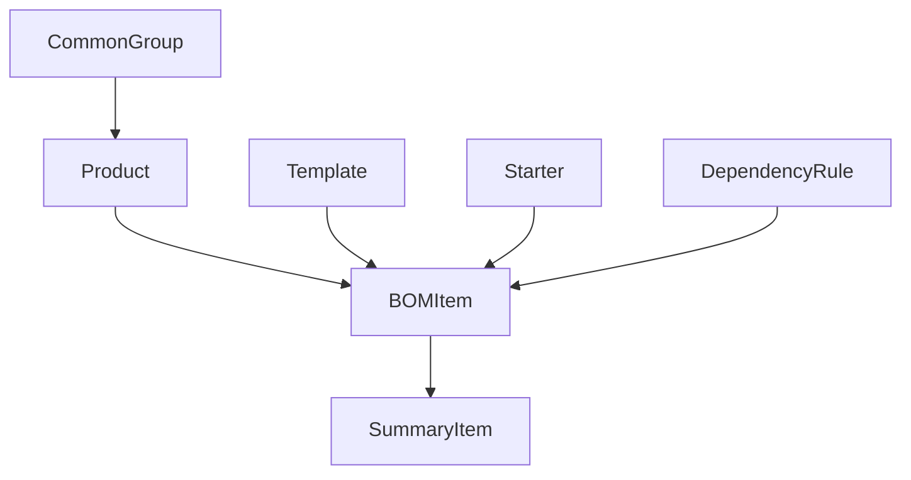

# 05. Data Layer & Type System

**Phiên bản:** 1.0  
**Cập nhật:** 07/12/2025  
**Độ khó:** Intermediate

---

## Mục Lục

1. [Overview - Type System](#1-overview---type-system)
2. [Core Types](#2-core-types)
3. [Logic Types](#3-logic-types)
4. [Type Utilities](#4-type-utilities)
5. [Data Models Chi Tiết](#5-data-models-chi-tiết)
6. [Type Safety Patterns](#6-type-safety-patterns)
7. [Data Transformation](#7-data-transformation)

---

## 1. Overview - Type System

### 1.1 Tại Sao Cần Types?

**TypeScript Types = Contract cho data**

```typescript
// ❌ JavaScript: Runtime error
function getPrice(product) {
  return product.price * 1.1;  // product không có price? → undefined * 1.1 = NaN
}

// ✅ TypeScript: Compile-time error
function getPrice(product: Product) {
  return product.price * 1.1;  // Compile error nếu Product không có price
}
```

**Lợi ích:**
- ✅ Catch bugs trước khi chạy
- ✅ IDE autocomplete chính xác
- ✅ Refactor an toàn
- ✅ Self-documenting code

### 1.2 Type System Architecture

```
types/
├── index.ts      # Core business types (Product, BOMItem, Starter...)
└── logic.ts      # Logic system types (Rule, Config, Mapping...)
```

**Phân loại:**
- **Domain Types:** Product, BOMItem, SummaryItem (business data)
- **Config Types:** Template, Starter (configuration)
- **Logic Types:** DependencyRule, MappingTable (auto-selection logic)
- **UI Types:** Props interfaces cho components

---

## 2. Core Types

### 2.1 Unit Type

**File:** `types/index.ts`

```typescript
export type Unit = 'cái' | 'bộ' | 'chiếc' | 'mét' | 'm' | 'md';
```

**Usage:**
```typescript
const product: Product = {
  unit: 'cái'  // ✅ OK
};

const invalid: Product = {
  unit: 'kg'   // ❌ Type error
};
```

**Lý do dùng string literal union:**
- Type-safe: Chỉ accept values xác định
- Autocomplete: IDE suggest đúng 6 options
- No runtime overhead: Compile thành string

---

### 2.2 Product Interface

**Core data model cho tất cả products**

```typescript
export interface Product {
  ibomCode: string;      // IBOM identifier (unique)
  description: string;   // Mô tả sản phẩm
  code: string;          // Vendor code
  brand: string;         // Nhãn hiệu (Schneider, Mitsubishi...)
  unit: Unit;            // Đơn vị
}
```

**Example:**
```typescript
const cb100: Product = {
  ibomCode: 'CB-3P-100A',
  description: 'Circuit Breaker 3P 100A',
  code: 'GV3P100',
  brand: 'Schneider',
  unit: 'cái'
};
```

**Design Decisions:**

**Q: Tại sao không dùng `id` thay vì `ibomCode`?**  
A: `ibomCode` mang semantics rõ ràng, follow domain language

**Q: Tại sao `brand` là string, không phải enum?**  
A: Brands có thể thay đổi, add mới → Flexible hơn enum

**Q: Có cần `price` field?**  
A: Không. App focus vào khối lượng, giá fetch từ hệ thống khác

---

### 2.3 BOMItem Interface

**Product + Metadata cho BOQ**

```typescript
export interface BOMItem extends Product {
  starterIndex?: number;           // Thuộc starter nào (0-based index)
  quantity: number;                // Số lượng
  source: 'template' | 'auto' | 'manual';  // Nguồn gốc item
  note?: string;                   // Ghi chú (optional)
}
```

**Extends Product:**
- Kế thừa tất cả fields của Product
- Thêm metadata cho BOQ context

**Fields chi tiết:**

| Field | Type | Required | Mô tả |
|-------|------|----------|-------|
| `starterIndex` | `number` | No | Index của starter (nếu từ template). `undefined` nếu manual item |
| `quantity` | `number` | Yes | Số lượng, luôn >= 0 |
| `source` | `'template' \| 'auto' \| 'manual'` | Yes | Nguồn: Template item / Auto-selected / Manual thêm |
| `note` | `string` | No | Ghi chú thêm |

**Examples:**

```typescript
// Template item
const cbFromTemplate: BOMItem = {
  ...cb100,
  starterIndex: 0,
  quantity: 1,
  source: 'template'
};

// Auto-selected item
const busbar: BOMItem = {
  ibomCode: 'BUSBAR-20x5',
  description: 'Busbar 20x5',
  code: 'BB20x5',
  brand: 'Local',
  unit: 'm',
  starterIndex: 0,
  quantity: 3,
  source: 'auto',
  note: 'Auto từ CB 100A'
};

// Manual item
const specialCable: BOMItem = {
  ibomCode: 'CABLE-SPECIAL',
  description: 'Cáp đặc biệt',
  code: 'CAB-SP',
  brand: 'Custom',
  unit: 'mét',
  quantity: 10,
  source: 'manual',
  // No starterIndex (không liên kết starter)
};
```

---

### 2.4 SummaryItem Interface

**Aggregated data cho Summary View**

```typescript
export interface SummaryItem extends Product {
  quantity: number;       // Tổng số lượng (sum from all starters)
  totalQuantity: number;  // Alias for quantity (legacy)
}
```

**Generation logic:**
```typescript
// From BOM to Summary
const bom: BOMItem[] = [
  { ibomCode: 'CB-100A', quantity: 1, ... },
  { ibomCode: 'CB-100A', quantity: 2, ... },  // Same product
  { ibomCode: 'CT-100A', quantity: 3, ... }
];

const summary: SummaryItem[] = [
  { ibomCode: 'CB-100A', quantity: 3, ... },  // 1 + 2 = 3
  { ibomCode: 'CT-100A', quantity: 3, ... }
];
```

**Code:** `utils/boq-logic.ts::generateSummary()`

---

### 2.5 Starter Interface

**Configuration cho mỗi starter**

```typescript
export interface Starter {
  type: string;                        // Template type (DOL, Star-Delta...)
  rating?: string;                     // Motor rating (15HP, 20HP...)
  quantity: number;                    // Số lượng starter
  customParams?: Record<string, any>;  // Custom parameters
}
```

**Examples:**

```typescript
// DOL Starter
const dolStarter: Starter = {
  type: 'DOL',
  rating: '15HP',
  quantity: 3
};

// Star-Delta with timer
const sdStarter: Starter = {
  type: 'Star-Delta w/ Timer',
  rating: '30HP',
  quantity: 1,
  customParams: {
    timerDelay: 5  // seconds
  }
};
```

**Design:**
- `rating` optional vì một số templates không cần (e.g., "Manual Starter")
- `customParams` cho extensibility (future parameters)

---

### 2.6 Template Interface

**Definition của starter templates**

```typescript
export interface Template {
  type: string;             // Unique identifier
  name: string;             // Display name
  requiresRating: boolean;  // Có cần chọn rating?
  items: TemplateItem[];    // Danh sách items trong template
}

export interface TemplateItem {
  ibomCode: string;            // Product code (có thể có placeholder)
  quantity: number | string;   // Fixed number hoặc formula
}
```

**Example:**

```typescript
const dolTemplate: Template = {
  type: 'DOL',
  name: 'DOL Starter',
  requiresRating: true,
  items: [
    { ibomCode: 'CB-{rating}', quantity: 1 },
    { ibomCode: 'CT-{rating}', quantity: 3 },
    { ibomCode: 'OLR-{rating}', quantity: 1 },
    { ibomCode: 'START-BTN', quantity: 1 },
    { ibomCode: 'STOP-BTN', quantity: 1 },
    { ibomCode: 'INDICATOR-GREEN', quantity: 1 },
    { ibomCode: 'INDICATOR-RED', quantity: 1 }
  ]
};
```

**Placeholder replacement:**
```typescript
// User: rating='15HP', quantity=3
// Result:
// CB-15HP x1 (per starter) → Total: 3
// CT-15HP x3 (per starter) → Total: 9
```

**Formula in quantity:**
```typescript
{
  ibomCode: 'TERMINAL',
  quantity: '{quantity}*4'  // String formula
}
// quantity=3 → 3*4 = 12 terminals
```

---

## 3. Logic Types

### 3.1 CommonGroup Interface

**Data structure cho Common Logic groups**

```typescript
export interface CommonGroup {
  id: string;           // Unique ID (GRP_1, GRP_HEAT_SHRINK...)
  name: string;         // Display name
  logicText?: string;   // Logic description (optional)
  items: CommonItem[];  // Products trong group
}

export interface CommonItem extends Product {
  // Same as Product, có thể extend thêm fields
}
```

**Example:**

```typescript
const grpHeatShrink: CommonGroup = {
  id: 'GRP_HEAT_SHRINK',
  name: 'Co Nhiệt',
  logicText: 'Heat shrink tubes for busbar insulation',
  items: [
    {
      ibomCode: 'CN-20x5-DO',
      description: 'Co nhiệt thanh cái 20x5 đỏ',
      code: 'HS-20x5-R',
      brand: 'Local',
      unit: 'm'
    },
    {
      ibomCode: 'CN-20x5-V',
      description: 'Co nhiệt thanh cái 20x5 vàng',
      code: 'HS-20x5-Y',
      brand: 'Local',
      unit: 'm'
    }
    // ... Blue, Black
  ]
};
```

**Storage:** `localStorage.boq_common_groups` (JSON serialized)

---

### 3.2 DependencyRule Interface

**Configuration cho auto-selection rules**

```typescript
export interface DependencyRule {
  id: string;                    // Rule identifier
  mainGroup: string;             // Source group ID
  dependentGroup: string;        // Target group ID
  strategy: RuleStrategy;        // Strategy to use
  mappingKey?: string;           // Key for mapping table (nếu SIZE_MAPPING)
  enabled: boolean;              // Enable/disable rule
  phaseColumns?: string[];       // Columns for phase items (Heat Shrink)
  quantityFormula?: string;      // Custom quantity formula
}

export type RuleStrategy = 
  | 'SAME_RATING'     // Match by rating
  | 'SIZE_MAPPING'    // Use mapping table
  | 'DEPENDENT';      // Based on other group qty
```

**Example: Heat Shrink Rule**

```typescript
const heatShrinkRule: DependencyRule = {
  id: 'rule_heat_shrink',
  mainGroup: 'GRP_3',           // CB Tổng
  dependentGroup: 'GRP_HEAT_SHRINK',
  strategy: 'SIZE_MAPPING',
  mappingKey: 'busbar',         // Use busbar mapping table
  enabled: true,
  phaseColumns: ['main', 'UpDown']
};
```

**Example: MCT Rule**

```typescript
const mctRule: DependencyRule = {
  id: 'rule_mct',
  mainGroup: 'GRP_3',
  dependentGroup: 'GRP_17_MCT',
  strategy: 'SAME_RATING',
  enabled: true
  // No mappingKey needed for SAME_RATING
};
```

---

### 3.3 MappingTable Type

**Mapping data cho SIZE_MAPPING strategy**

```typescript
export interface MappingTable {
  [ratingKey: string]: {
    main?: string;      // Main busbar size
    updown?: string;    // Up/Down busbar size
    neutral?: string;   // Neutral busbar size
    earth?: string;     // Earth busbar size
  };
}
```

**Example:**

```typescript
const busbarMapping: MappingTable = {
  '100': {
    main: '3x 20x5',
    updown: '3x 20x5',
    neutral: '20x5',
    earth: '20x5'
  },
  '200': {
    main: '3x 20x8',
    updown: '3x 20x5',
    neutral: '20x5'
  },
  '300': {
    main: '3x 30x10',
    updown: '3x 20x8',
    neutral: '20x8'
  }
};
```

**Usage in logic:**
```typescript
// CB 200A selected
const rating = '200';
const sizes = busbarMapping[rating];
// sizes = { main: '3x 20x8', updown: '3x 20x5', neutral: '20x5' }

// Extract size: "3x 20x8" → actualSize = "20x8", qty = 3
```

---

### 3.4 LogicConfig Interface

**Top-level config cho toàn bộ logic system**

```typescript
export interface LogicConfig {
  rules: DependencyRule[];                      // All rules
  mappingTables: Record<string, MappingTable>;  // All mapping tables
}
```

**Example:**

```typescript
const config: LogicConfig = {
  rules: [
    { id: 'rule_heat_shrink', ... },
    { id: 'rule_busbar', ... },
    { id: 'rule_mct', ... }
  ],
  mappingTables: {
    busbar: { ... },
    cable: { ... }
  }
};
```

**Storage:** `localStorage.logicConfig` hoặc `src/data/logic-config.json`

---

## 4. Type Utilities

### 4.1 Type Guards

**Runtime type checking**

```typescript
// Check if item is from template
export function isTemplateItem(item: BOMItem): boolean {
  return item.source === 'template';
}

// Check if item is auto-selected
export function isAutoItem(item: BOMItem): boolean {
  return item.source === 'auto';
}

// Type predicate (narrow type)
export function hasRating(starter: Starter): starter is Required<Pick<Starter, 'rating'>> & Starter {
  return starter.rating !== undefined;
}

// Usage:
if (hasRating(starter)) {
  // TS knows starter.rating is string (not string | undefined)
  const rating = starter.rating.toUpperCase();
}
```

### 4.2 Type Transformations

**Partial, Pick, Omit utilities**

```typescript
// Update starter with partial data
function updateStarter(
  starter: Starter,
  updates: Partial<Starter>  // All fields optional
): Starter {
  return { ...starter, ...updates };
}

// Create summary item (omit BOM-specific fields)
type SummaryFields = Omit<BOMItem, 'starterIndex' | 'source' | 'note'>;

// Pick only essential fields
type ProductSummary = Pick<Product, 'ibomCode' | 'description' | 'quantity'>;
```

### 4.3 Readonly Types

**Immutability hints**

```typescript
// Readonly array
const ALLOWED_UNITS: readonly Unit[] = ['cái', 'bộ', 'chiếc', 'mét', 'm', 'md'];

// Readonly object
type ReadonlyProduct = Readonly<Product>;

const product: ReadonlyProduct = { ... };
product.brand = 'New Brand';  // ❌ Compile error
```

---

## 5. Data Models Chi Tiết

### 5.1 Product Lifecycle

```
1. DEFINITION
   Product defined in common-logic.json or library.ts

2. STORAGE
   Saved to localStorage.boq_library or boq_common_groups

3. SELECTION
   User picks from Product Picker → Add to group

4. USAGE IN BOQ
   Product → BOMItem (add quantity, source, starterIndex)

5. AGGREGATION
   BOMItem[] → SummaryItem[] (group by ibomCode, sum qty)

6. EXPORT
   SummaryItem → Excel row
```

### 5.2 Data Relationships



**Relationships:**
- `BOMItem` **extends** `Product` (is-a relationship)
- `SummaryItem` **extends** `Product`
- `Template` **contains** `TemplateItem[]` (has-many)
- `CommonGroup` **contains** `CommonItem[]` (has-many)
- `Starter` **references** `Template` (by type)

### 5.3 Data Validation

**Type-safe validation helpers**

```typescript
// Validate unit
export function isValidUnit(unit: string): unit is Unit {
  const validUnits: Unit[] = ['cái', 'bộ', 'chiếc', 'mét', 'm', 'md'];
  return validUnits.includes(unit as Unit);
}

// Validate quantity
export function isValidQuantity(qty: number): boolean {
  return Number.isFinite(qty) && qty >= 0;
}

// Validate product
export function validateProduct(product: Product): string[] {
  const errors: string[] = [];
  
  if (!product.ibomCode) errors.push('ibomCode is required');
  if (!product.description) errors.push('description is required');
  if (!isValidUnit(product.unit)) errors.push('Invalid unit');
  
  return errors;
}
```

---

## 6. Type Safety Patterns

### 6.1 Discriminated Unions

**Type-safe source field**

```typescript
type BOMItemSource = 
  | { source: 'template'; starterIndex: number }
  | { source: 'auto'; starterIndex: number; note: string }
  | { source: 'manual'; starterIndex?: never };

// TS can narrow type based on 'source'
function getItemOrigin(item: BOMItemSource): string {
  switch (item.source) {
    case 'template':
      return `Template starter #${item.starterIndex}`;
    case 'auto':
      return `Auto from starter #${item.starterIndex}: ${item.note}`;
    case 'manual':
      return 'Manually added';
  }
}
```

### 6.2 Branded Types

**Prevent mixing incompatible strings**

```typescript
// Brand ibomCode to prevent using regular string
type IBOMCode = string & { __brand: 'IBOMCode' };

function createIBOMCode(code: string): IBOMCode {
  // Validate format
  if (!/^[A-Z0-9-]+$/.test(code)) {
    throw new Error('Invalid IBOM code format');
  }
  return code as IBOMCode;
}

// Usage:
const code = createIBOMCode('CB-100A');  // IBOMCode
const product: Product = {
  ibomCode: code,  // ✅ OK
  // ...
};

const invalidCode: IBOMCode = 'invalid code';  // ❌ Error
```

### 6.3 Generic Types

**Reusable type patterns**

```typescript
// Generic paginated response
interface PaginatedResult<T> {
  items: T[];
  total: number;
  page: number;
  pageSize: number;
}

type ProductPage = PaginatedResult<Product>;
type BOMItemPage = PaginatedResult<BOMItem>;

// Generic picker state
interface PickerState<T> {
  items: T[];
  selected: T[];
  searchQuery: string;
}

type ProductPickerState = PickerState<Product>;
```

---

## 7. Data Transformation

### 7.1 Product → BOMItem

```typescript
function productToBOMItem(
  product: Product,
  quantity: number,
  source: BOMItem['source'],
  starterIndex?: number
): BOMItem {
  return {
    ...product,
    quantity,
    source,
    starterIndex
  };
}

// Usage:
const cb = findProduct('CB-100A');
const bomItem = productToBOMItem(cb, 1, 'template', 0);
```

### 7.2 BOMItem[] → SummaryItem[]

```typescript
function aggregateBOMItems(items: BOMItem[]): SummaryItem[] {
  const grouped = new Map<string, SummaryItem>();
  
  items.forEach(item => {
    const existing = grouped.get(item.ibomCode);
    
    if (existing) {
      existing.quantity += item.quantity;
    } else {
      grouped.set(item.ibomCode, {
        ibomCode: item.ibomCode,
        description: item.description,
        code: item.code,
        brand: item.brand,
        unit: item.unit,
        quantity: item.quantity,
        totalQuantity: item.quantity
      });
    }
  });
  
  return Array.from(grouped.values());
}
```

### 7.3 JSON ↔ TypeScript

**Serialization/Deserialization**

```typescript
// Export to JSON
function exportToJSON(data: CommonGroup[]): string {
  return JSON.stringify(data, null, 2);
}

// Import from JSON
function importFromJSON(json: string): CommonGroup[] {
  const data = JSON.parse(json);
  
  // Validate structure
  if (!Array.isArray(data)) {
    throw new Error('Invalid format: expected array');
  }
  
  // Runtime validation for each group
  data.forEach(group => {
    if (!group.id || !group.name || !Array.isArray(group.items)) {
      throw new Error(`Invalid group structure: ${JSON.stringify(group)}`);
    }
  });
  
  return data as CommonGroup[];
}
```

---

## 📚 Tài Liệu Liên Quan

- [06. Logic Engine Architecture](./06-logic-engine.md) - Sử dụng các types này
- [07. UI Component System](./07-ui-components.md) - Props interfaces
- [08. State Management](./08-state-management.md) - State types

---

**Hết Document 05**
