# BOQ Generator — Hướng dẫn sử dụng

> Tài liệu thao tác dành cho **người dùng cuối** (bóc khối lượng vật tư tủ điện). Cập nhật cho bản đã recode: **không còn Common Logic**, công suất là **text hiển thị** (`powerLabel`) tách khỏi khóa chọn tier (`tierKey`), toàn bộ hộp thoại là modal trong app (không còn popup trình duyệt).

Mục lục:

1. [Khái niệm & mô hình dữ liệu 3 tầng](#1-khái-niệm--mô-hình-dữ-liệu-3-tầng)
2. [Giao diện tổng thể](#2-giao-diện-tổng-thể)
3. [Quản lý dự án](#3-quản-lý-dự-án)
4. [Nhập phụ tải & sinh BOQ](#4-nhập-phụ-tải--sinh-boq)
5. [Nhập/Xuất phụ tải bằng Excel](#5-nhậpxuất-phụ-tải-bằng-excel)
6. [Xuất BOQ (Export BOQ)](#6-xuất-boq-export-boq)
7. [Workbook: Xuất / Nhập / Hoàn tác](#7-workbook-xuất--nhập--hoàn-tác)
8. [Sao lưu & Phục hồi (Back-up/Restore)](#8-sao-lưu--phục-hồi-back-uprestore)
9. [Admin Panel — quản trị dữ liệu nguồn](#9-admin-panel--quản-trị-dữ-liệu-nguồn)
10. [Cảnh báo & lỗi thường gặp](#10-cảnh-báo--lỗi-thường-gặp)
11. [Phụ lục: dữ liệu được lưu ở đâu](#11-phụ-lục-dữ-liệu-được-lưu-ở-đâu)

---

## 1. Khái niệm & mô hình dữ liệu 3 tầng

App sinh bảng khối lượng (BOQ) từ **danh sách phụ tải** (starter) mà bạn khai báo, dựa trên **template** và **thư viện sản phẩm**. Ba tầng dữ liệu:

**1. Match Key (khóa khớp — generic).** Là mã kỹ thuật KHÔNG phụ thuộc nhãn hiệu, ví dụ `CONTACTOR_9A`, `MCB_32A`, `ESTOP`. Match Key là "cầu nối" giữa template và sản phẩm thật.

**2. Product (sản phẩm thật).** Một dòng trong Thư viện sản phẩm (Product Library): có `Match Key` + `Nhãn hiệu (Brand)` + `Mã SP (code)` + `Mã iBom` + `Mô tả` + `Đơn vị`. Một Match Key có thể có nhiều Product theo từng brand (ví dụ `CONTACTOR_9A` × Schneider / Mitsubishi / LS...).

**3. BOMItem (dòng BOQ).** Là dòng vật tư sinh ra khi app duyệt từng phụ tải, lấy template theo `(Starter Type, tier)`, khớp từng dòng template với sản phẩm theo `Match Key + Brand`. Khối lượng = `qty của dòng template × số lượng phụ tải`.

**Starter template** là "công thức vật tư" cho một loại tủ: cấu trúc `{ Starter Type → { tier → danh sách dòng } }`. Mỗi **dòng template (component)** gồm `Match Key`, `Qty`, và `Condition` (điều kiện áp dụng — ví dụ chỉ thêm khi bật `Thermal`).

**Công suất (Power) — chỉ để hiển thị.** Sau recode, công suất tách làm hai:
- **`tierKey`**: khóa chọn tier template (chọn ra tập vật tư). Trong Input Wizard đây là dropdown **Power (kW)**.
- **`powerLabel`**: chuỗi text tự do chỉ để **hiển thị** trên báo cáo (ví dụ `"5.5kW"`, `"11kW (biến tần)"`), KHÔNG dùng để tính toán/khớp.

**Điều kiện (Condition) của dòng template:** `Always` (luôn có), hoặc theo tín hiệu của phụ tải: `Isolator`, `Thermal`, `PTC`, `E-Stop`, `Humidity`, `Iso BFP`, `E-Stop BFP`, `Iso/Estop FB`.

---

## 2. Giao diện tổng thể

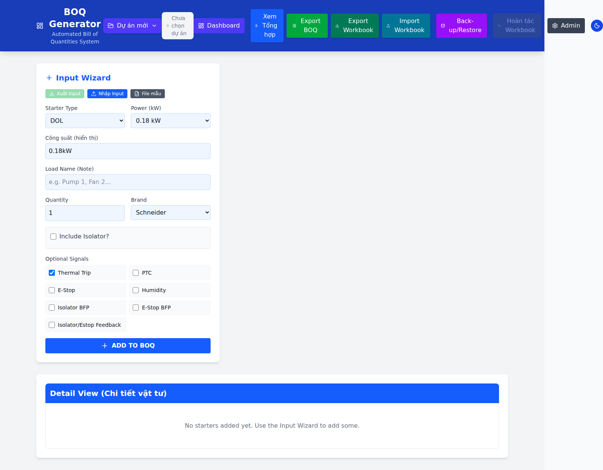

Thanh header (trái → phải):

**1. Logo "BOQ Generator"** — click mở **Dashboard**.

**2. Bộ chọn dự án** — hiển thị tên dự án hiện tại hoặc "Dự án mới"; nút 💾 bên cạnh để **Lưu dự án**.

**3. Dashboard** — mở bảng tổng quan.

**4. Xem Tổng hợp / Xem Chi tiết** — lật giữa bảng **Detail** (chi tiết từng phụ tải) và **Summary** (tổng hợp gộp theo mã).

**5. Export BOQ** — xuất bảng BOQ (Detail & Summary) ra Excel (có hộp tùy chọn).

**6. Export Workbook** — xuất **toàn bộ dữ liệu nguồn** (thư viện, template, brand, dự án...) thành một workbook nhiều sheet.

**7. Import Workbook** — nhập workbook, **xem trước thay đổi** rồi mới áp dụng.

**8. Back-up/Restore** — sao lưu/phục hồi dữ liệu ra file JSON.

**9. Hoàn tác Workbook** — hoàn tác **một lần** thao tác Import Workbook gần nhất (mờ đi nếu chưa áp dụng workbook nào).

**10. Admin** — mở Admin Panel để quản trị Product / Template / Match Key / Brand.

**11. Nút sáng/tối** — đổi giao diện Light/Dark (ghi nhớ trong trình duyệt).

---

## 3. Quản lý dự án

Mỗi **dự án** giữ danh sách phụ tải + các chỉnh sửa số lượng của riêng nó. Dữ liệu nguồn (thư viện, template, brand) dùng chung cho mọi dự án.

**Tạo dự án mới:** mở dropdown bộ chọn dự án → **Dự án mới** → nhập **Tên dự án \*** (bắt buộc) + **Mô tả (tùy chọn)** → **Tạo dự án**.

**Lưu thành bản khác (clone):** dropdown → **Lưu thành bản khác** → đặt tên → **Lưu bản sao**. Bản mới mang theo toàn bộ phụ tải + chỉnh sửa hiện tại. Đây cũng là cách "đổi tên" trên thực tế (tạo bản mới với tên khác).

**Chuyển dự án:** click vào một dự án trong danh sách. Mỗi dòng hiển thị `tên • {n} starters • ngày cập nhật`.

**Xóa dự án:** rê chuột vào dòng → nút 🗑️ → hộp thoại **"Xoá dự án"** (*"Xóa dự án này? Hành động này không thể hoàn tác."*) → **Xoá**.

**Tự động lưu:** app tự lưu vào dự án đang mở sau ~1 giây kể từ thay đổi cuối. Nếu đóng/tải lại tab khi còn thay đổi chưa lưu, trình duyệt sẽ cảnh báo.

---

## 4. Nhập phụ tải & sinh BOQ

Khối **Input Wizard** (cột trái) để khai báo từng phụ tải:

**1. Starter Type** — loại tủ (DOL, Star-Delta, VFD, Soft-Starter... lấy từ template).

**2. Power (kW)** — chọn **tier** template (quyết định tập vật tư). Danh sách tier lấy theo Starter Type đã chọn.

**3. Công suất (hiển thị)** — ô text `powerLabel`, tự điền `<tier>kW`, bạn sửa tự do để in lên báo cáo (ví dụ `11kW (biến tần)`). **Không** ảnh hưởng vật tư.

**4. Load Name (Note)** — tên phụ tải (ví dụ "Bơm 1"), giúp phân biệt trong báo cáo.

**5. Quantity** — số lượng phụ tải giống nhau (nhân vào khối lượng vật tư).

**6. Brand** — nhãn hiệu áp dụng cho thiết bị đóng cắt của phụ tải.

**7. Include Isolator?** — bật để thêm isolator (kèm chọn Isolator Brand riêng).

**8. Optional Signals** — các tín hiệu: `Thermal Trip`, `PTC`, `E-Stop`, `Humidity`, `Isolator BFP`, `E-Stop BFP`, `Isolator/Estop Feedback`. Các tín hiệu này kích hoạt những dòng template có Condition tương ứng.

Nhấn **ADD TO BOQ** để thêm. App sinh ngay các dòng vật tư ở **Detail View**.

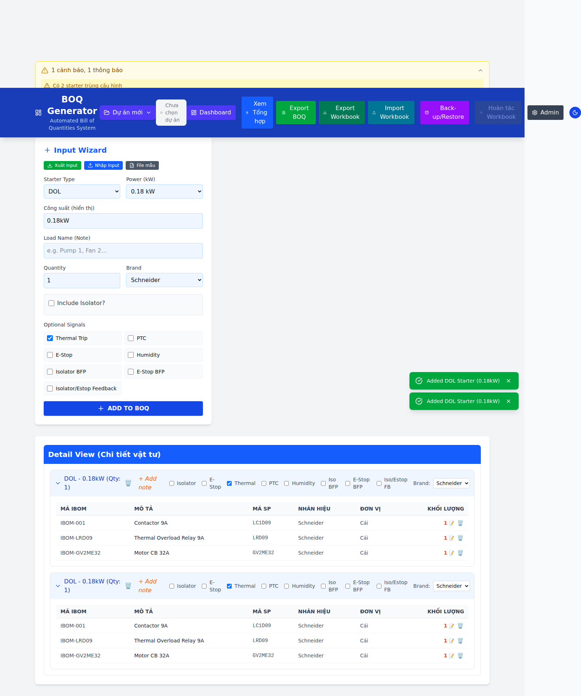

**Detail View (Chi tiết vật tư).** Mỗi phụ tải là một khối, tiêu đề `{Type} - {power}kW (Qty: n)`. Cột: **MÃ IBOM · MÔ TẢ · MÃ SP · NHÃN HIỆU · ĐƠN VỊ · KHỐI LƯỢNG**. Trong mỗi khối bạn có thể:

- **Sửa tín hiệu ngay** bằng các checkbox trên đầu khối (Isolator, E-Stop, Thermal, PTC, Humidity, Iso BFP...) — vật tư cập nhật tức thì.
- **Đổi Brand** của phụ tải bằng dropdown ở góc phải khối.
- **Đặt/sửa tên tải**: click vào `+ Add note`.
- **Chỉnh khối lượng từng dòng (override)**: click vào số ở cột KHỐI LƯỢNG. Dòng đã override hiện ✏️ và nút 🔄 để **khôi phục mặc định**; dòng chưa override có nút 🗑️ để loại (đặt qty = 0).
- **Xóa phụ tải**: nút 🗑️ ở tiêu đề khối → xác nhận **"Xoá bộ khởi động"**.
- Dòng **NOT_FOUND** (không tìm thấy sản phẩm khớp) được tô **đỏ** — cần bổ sung sản phẩm vào thư viện trước khi xuất.

**Summary View (Tổng hợp vật tư).** Nhấn **Xem Tổng hợp** để xem bảng gộp toàn dự án theo mã (`Mã iBom` → `Mã SP` → mô tả). Bảng này **bỏ** các dòng NOT_FOUND và dòng có khối lượng ≤ 0.

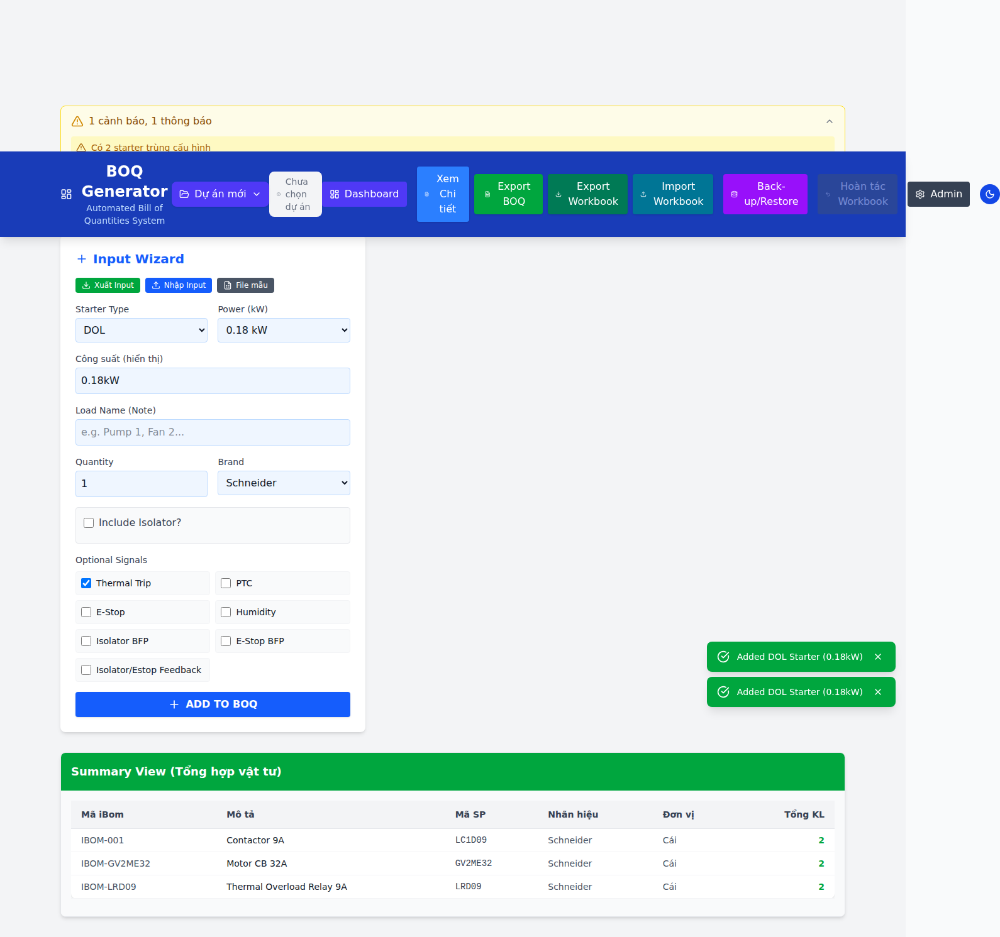

---

## 5. Nhập/Xuất phụ tải bằng Excel

Ba nút ở đầu khối Input Wizard:

**Xuất Input** — xuất danh sách phụ tải đang có ra `BOQ_Input_Data.xlsx` (mờ khi chưa có phụ tải nào).

**File mẫu** — tải `Import_Template.xlsx` (2 dòng ví dụ) để bạn điền hàng loạt. Cột chính: `Type, Power, Quantity, LoadName, Brand, Isolator, Thermal, PTC, Estop, Humidity...`.

**Nhập Input** — nhập hàng loạt phụ tải từ Excel. Luồng:

1. Chọn file `.xlsx/.xls`.
2. Nếu file có **giá trị lạ** (brand/type chưa có trong catalog) → hộp thoại **"Giá trị lạ trong file"** liệt kê giá trị lạ, ba lựa chọn:
   - **Thêm vào catalog** — thêm brand/type mới rồi nhập.
   - **Bỏ qua dòng lạ** — bỏ những dòng có giá trị lạ.
   - **Huỷ** — không nhập gì.

   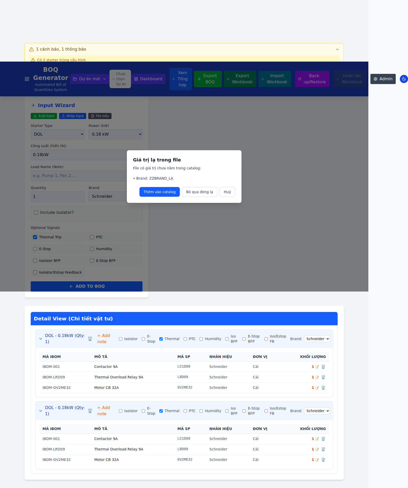

3. Nếu có dòng ở mức công suất **chưa có template**, app cảnh báo các dòng đó **sẽ không sinh vật tư**.
4. Hộp thoại **"Nhập phụ tải"**: chọn **Thêm vào (n hiện có)** (nối tiếp) hoặc **Thay thế toàn bộ** (xóa hết rồi nhập). Nếu chọn thay thế, app hỏi xác nhận lần nữa (**"Xác nhận thay thế"**).
5. Kết quả: toast *"Đã nhập N phụ tải"*.

---

## 6. Xuất BOQ (Export BOQ)

Nhấn **Export BOQ**. Nếu dữ liệu còn **lỗi chặn**, app không mở hộp tùy chọn mà báo lỗi cần sửa. Nếu hợp lệ, mở hộp **Export Options**:

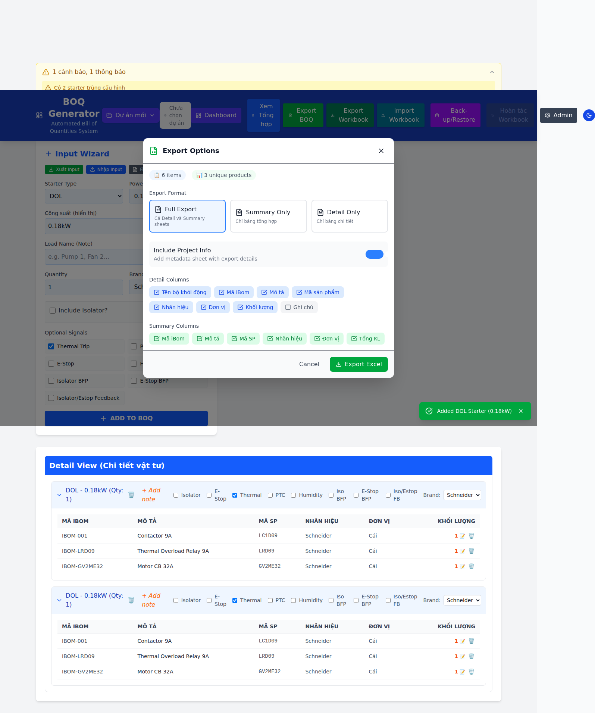

**Format:**
- **Full Export** — cả sheet Detail và Summary.
- **Summary Only** — chỉ bảng tổng hợp.
- **Detail Only** — chỉ bảng chi tiết.

**Include Project Info** — thêm sheet metadata (tên dự án, thông tin xuất).

**Chọn cột** cho Detail (Tên bộ khởi động, Mã iBom, Mô tả, Mã SP, Nhãn hiệu, Đơn vị, Khối lượng, Ghi chú) và Summary (Mã iBom, Mô tả, Mã SP, Nhãn hiệu, Đơn vị, Tổng KL).

Nhấn **Export Excel**. Tên file lấy theo tên dự án + hậu tố `_Detail`/`_Summary` tùy format.

**Các điều kiện chặn xuất** (app sẽ báo lỗi thay vì xuất file sai):
- Còn **lỗi validation** (error) trong dữ liệu.
- Còn dòng **NOT_FOUND** (chưa tìm thấy sản phẩm).
- **Số lượng/khối lượng không hợp lệ** (NaN, âm...).
- **`[SUMMARY_DETAIL_MISMATCH]`** — bảng Summary không khớp tổng của Detail (app tự đối chiếu để chống rò số liệu).

---

## 7. Workbook: Xuất / Nhập / Hoàn tác

**Workbook** là một file Excel gói **toàn bộ dữ liệu nguồn** thành nhiều sheet: `_Meta, Products, MatchKeys, Templates, Brands, Project, Starters, ManualLines, Overrides`. Dùng để chuyển/đồng bộ toàn bộ cấu hình giữa các máy.

**Export Workbook** — tải workbook nguồn (tên theo dự án).

**Import Workbook** — chọn file `.xlsx/.xls/.csv` → app dựng **bản xem trước thay đổi (diff)** rồi mở modal:

- Bốn ô tổng hợp: **Added / Updated / Deleted / Skipped**; bảng "Changes by sheet" theo từng sheet.
- Các loại thay đổi: `upsert` (thêm/sửa), `delete` (xóa), `skip` (bỏ qua), và riêng sheet **Templates** có `replace-tier` (thay toàn bộ dòng của một tier; tier không có trong file được **giữ nguyên**).
- Khối **Issues**: nhóm **Errors / Warnings / Information** với mã lỗi (ví dụ `UNKNOWN_BRAND`, `UNKNOWN_MATCH_KEY`, `INVALID_CONDITION`, `INVALID_TEMPLATE_QUANTITY`, `MISSING_META`...).
- Nút **Apply changes** để áp dụng; **bị chặn nếu còn Error** (phải sửa file trước). Trong lúc đang áp dụng (**"Applying..."**), các nút Close/Cancel/Escape đều bị khóa để tránh áp dụng dở dang.

**Hoàn tác Workbook** — sau khi Apply thành công, nút này sáng lên và cho phép **hoàn tác một lần** về trạng thái ngay trước lần Apply gần nhất (khôi phục cả dữ liệu nguồn lẫn trạng thái dự án).

---

## 8. Sao lưu & Phục hồi (Back-up/Restore)

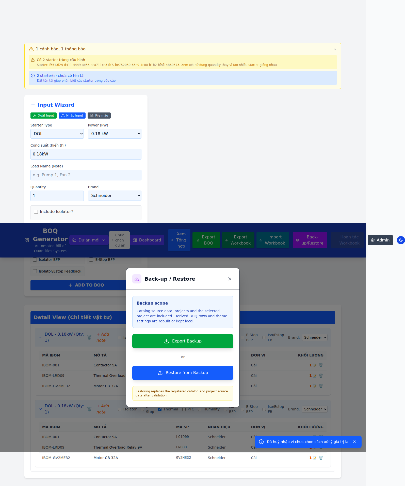

Nhấn **Back-up/Restore**:

**Export Backup** — tải file JSON `{tên-dự-án}-backup-YYYY-MM-DD.json`. **Phạm vi sao lưu:** thư viện sản phẩm (`boq_library`), template (`boq_templates`), brand (`boq_brands`), meta match key (`boq_matchkey_meta`), phiên bản schema, và toàn bộ dự án. (Các dòng BOQ dẫn xuất được dựng lại; cài đặt giao diện là cục bộ.)

**Restore from Backup** — chọn file JSON. App **validate** rồi thay thế toàn bộ catalog + dự án. ⚠️ Restore **ghi đè** dữ liệu nguồn hiện tại → nên **Export Backup trước** nếu cần giữ.

**Undo last restore** — hoàn tác **một lần** lần phục hồi gần nhất về trạng thái trước đó.

---

## 9. Admin Panel — quản trị dữ liệu nguồn

Nhấn **Admin**. Panel có 3 tab: **Product Library**, **Starter Templates**, **Match Key Manager** (Brand Manager mở từ tab Match Key).

### 9.1. Product Library — quản lý sản phẩm

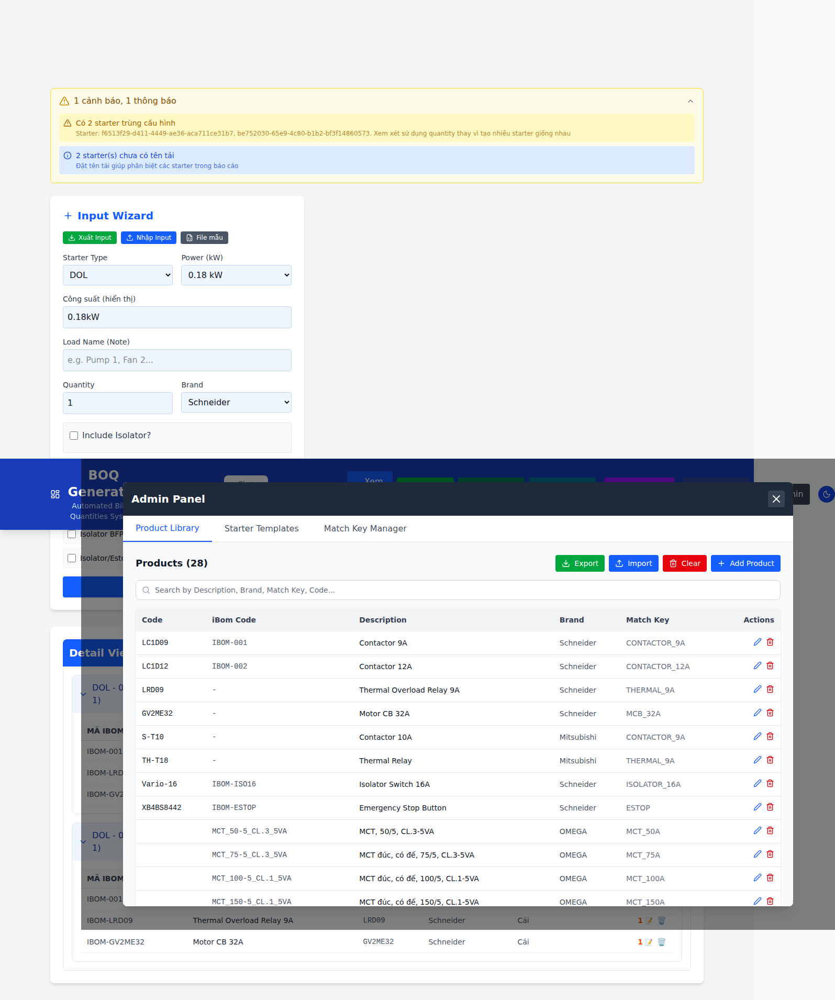

Thanh công cụ: **Export** (tải `Product_Library.xlsx`) · **Import** · **Clear** (xóa tất cả) · **Add Product** · ô tìm kiếm (theo Mô tả/Brand/Match Key/Code).

**Thêm sản phẩm mới:** **Add Product** → điền form:

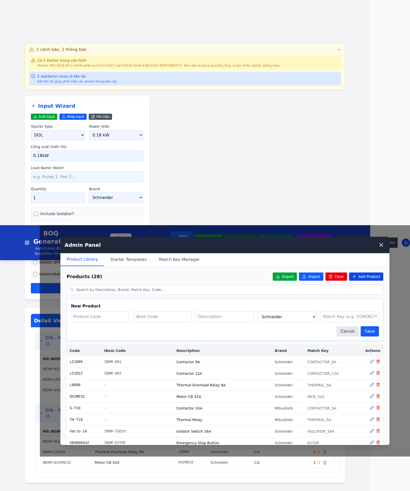

- **Product Code** (mã SP), **iBom Code**, **Description** (bắt buộc), **Brand** (bắt buộc), **Match Key** (ví dụ `CONTACTOR_9A` — tự chuẩn hóa khi gõ).
- Điều kiện hợp lệ: phải có **mô tả + đơn vị + brand** và **ít nhất một** trong `iBom / Product Code / Match Key`. Thiếu → app báo: *"Enter description, unit, brand, and at least one iBom, product, or Match Key identifier."*
- **Save** để lưu.

**Sửa sản phẩm:** nút Edit trên dòng → sửa → **Save**.

**Xóa 1 sản phẩm:** nút 🗑️ trên dòng → xác nhận *"Are you sure you want to delete this product?"*.

**Xóa tất cả:** **Clear** → cảnh báo *"WARNING: This will delete ALL products..."* → xác nhận.

**Import thư viện từ Excel:** **Import** → chọn file. Nếu có **brand lạ** → hộp thoại **"Nhãn hiệu lạ trong file"** (Thêm vào catalog / Bỏ qua dòng lạ / Huỷ). Sau đó chọn **Gộp vào (n SP)** hay **Thay thế toàn bộ** (thay thế sẽ hỏi xác nhận và khuyến nghị Export backup trước). Gộp theo khóa `(matchKey/code/ibom) + brand`.

### 9.2. Starter Templates — quản lý template

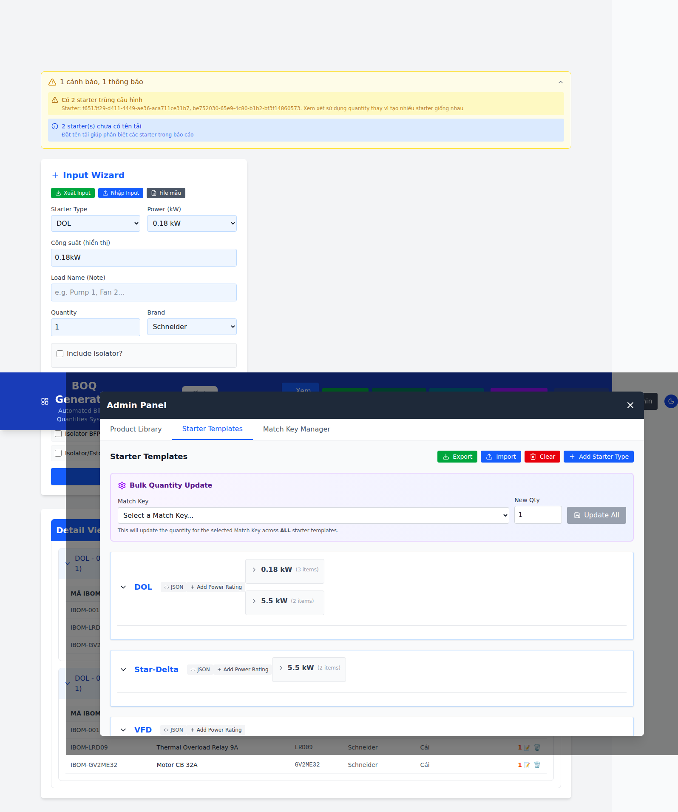

Thanh công cụ: **Export** (`Starter_Templates.xlsx`) · **Import** · **Clear** · **Add Starter Type**.

**Thêm loại tủ mới:** **Add Starter Type** → nhập tên (ví dụ `Soft-Starter`) → **Add**.

**Thêm tier công suất:** trong một type, nút **Add Power Rating** → nhập số kW → **Save** (phải là số ≥ 0, không trùng).

**Thêm dòng vật tư (component) vào tier:** nút **+ Add Component** trong tier → điền:
- **Match Key** (gợi ý từ thư viện, tự chuẩn hóa).
- **Qty** (> 0).
- **Condition**: `Always`, `Isolator`, `Thermal`, `PTC`, `E-Stop`, `Humidity`, `Iso BFP`, `E-Stop BFP`, `Iso/Estop FB`.
- Nếu Match Key **chưa có** trong thư viện, app hiện box **"New Product Detected"** để bạn điền iBom/Mô tả/Mã SP/Brand tạo luôn sản phẩm; nếu để trống, app hỏi **"Sản phẩm thiếu thông tin"** (Vẫn thêm / Huỷ — nếu vẫn thêm, sản phẩm sẽ thiếu trong thư viện).
- **Save Component**.

**Sửa số lượng dòng:** click vào `Qty` của dòng để sửa nhanh.

**Xóa dòng vật tư:** nút ✕ trên dòng → xác nhận *"Remove {MatchKey}?"*.

**Cập nhật số lượng hàng loạt (Bulk Quantity Update):** chọn **Match Key** + nhập **New Qty** + **Update All** — đổi qty của Match Key đó trên **mọi** template.

**Sửa dạng JSON:** nút **JSON** của một type mở **Template Editor** (soạn JSON bên trái + **Live Preview** bên phải, có kiểm tra hợp lệ). Đóng khi chưa lưu sẽ hỏi *"Đóng không lưu?"*. **Save Template** để ghi.

**Import template từ Excel:** **Import** → nếu file có **Condition không hợp lệ**, app **chặn** và liệt kê dòng sai (không thay đổi gì). Nếu hợp lệ, app tóm tắt "sẽ cập nhật/giữ nguyên/bỏ qua bao nhiêu mức" → **Tiếp tục** để áp dụng.

### 9.3. Match Key Manager — ma trận Match Key × Brand

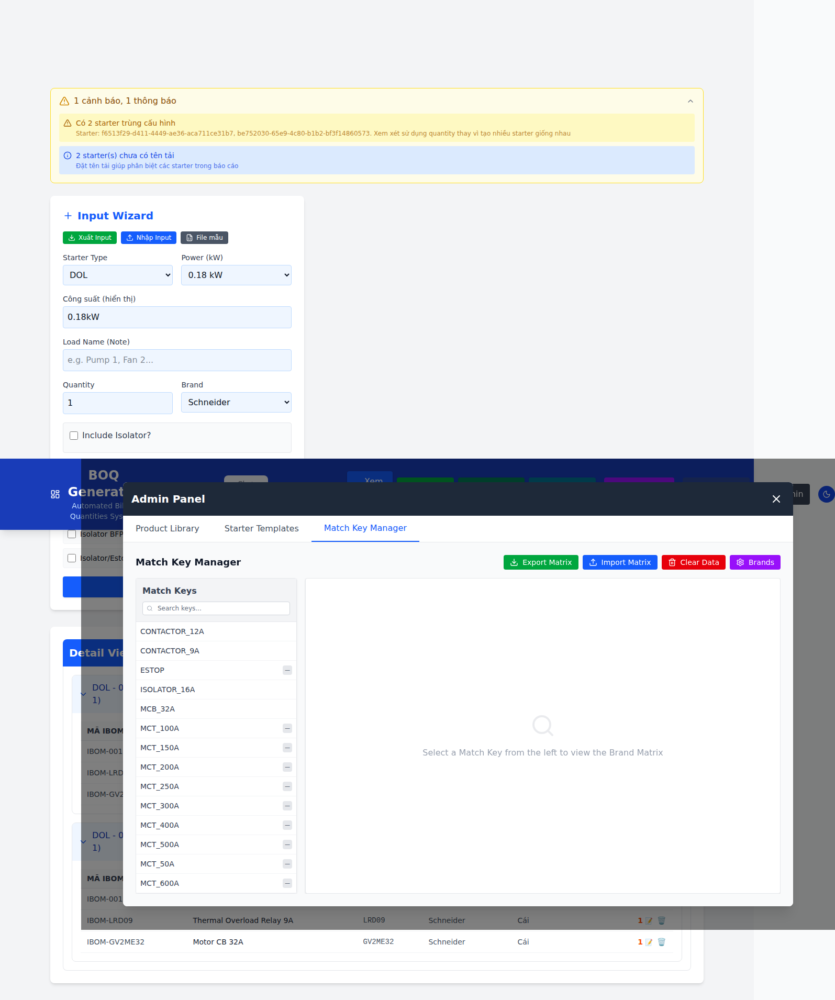

Thanh công cụ: **Export Matrix** (`Match_Keys_Matrix.xlsx`) · **Import Matrix** · **Clear Data** · **Brands**.

**Danh sách Match Key** (bên trái): tìm kiếm, mỗi key có thể mang dấu `—` (không phụ thuộc nhãn hiệu) và `!` (xung đột brand-agnostic).

**Chọn một Match Key** để xem **Brand Matrix** bên phải:
- Checkbox **Phụ thuộc nhãn hiệu** (brand-sensitive) và select **Nhóm thiết bị** (BREAKER/CONTACTOR/THERMAL/ISOLATOR/DRIVE/CT/ACCESSORY/CABLE/OTHER).
- Với key brand-sensitive: hiện thẻ cho **từng brand**, mỗi thẻ có sản phẩm hoặc nút **Add Product for {brand}** để tạo.
- **Delete Key** — xóa Match Key: sẽ **xóa mọi sản phẩm** mang key này khỏi thư viện **và** gỡ key khỏi **mọi template** (có xác nhận).

**Import Matrix từ Excel:** app đọc file rồi hiện tóm tắt (**Thêm mới / Cập nhật / Bỏ qua / Xung đột / Ô code bị xóa trắng**) và hỏi xác nhận. Lưu ý: ô code bị **xóa trắng** trong file **KHÔNG** bị tự xóa — app chỉ báo cáo. Sau khi nhập có modal **"Kết quả Import Match Key Matrix"** liệt kê chi tiết.

**Clear Data** — xóa mọi sản phẩm có Match Key (cảnh báo số lượng, khuyến nghị Export/Backup trước).

### 9.4. Brand Manager — quản lý nhãn hiệu

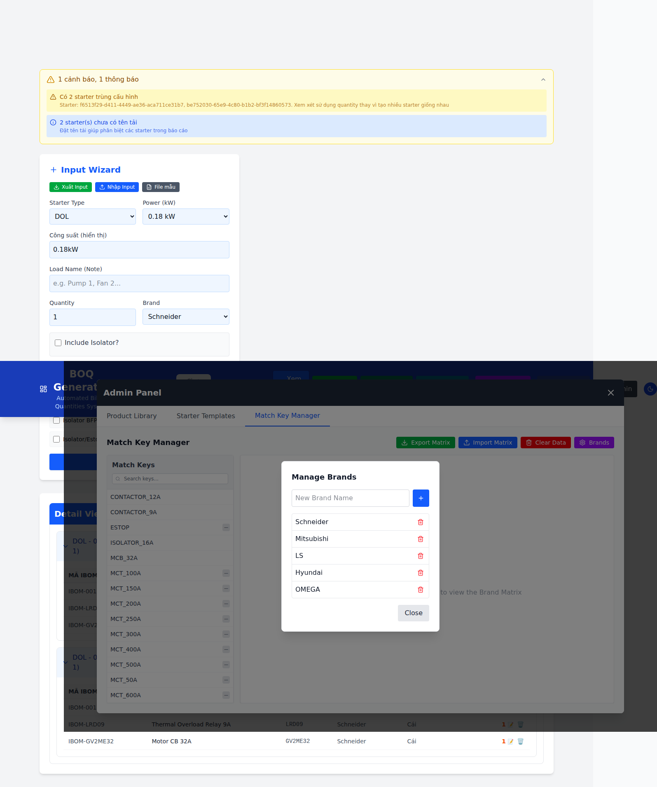

Mở từ nút **Brands** (tab Match Key). Nhập **New Brand Name** + ➕ để thêm. Xóa brand bằng nút 🗑️: nếu brand đang có sản phẩm, app hỏi **"Xoá nhãn hiệu"** — xóa brand **và** xóa luôn các sản phẩm thuộc brand đó (có xác nhận).

---

## 10. Cảnh báo & lỗi thường gặp

**Dòng NOT_FOUND (đỏ) trong Detail.** Phụ tải cần một Match Key nhưng thư viện **chưa có sản phẩm** khớp `Match Key + Brand`. Cách xử lý: vào **Admin → Product Library / Match Key Manager** thêm sản phẩm cho brand đó, hoặc đổi Brand của phụ tải. App **chặn Export BOQ** khi còn NOT_FOUND.

**"⚠️ mức công suất chưa có template".** Phụ tải chọn tier chưa có trong template của Starter Type → **không sinh vật tư**. Vào **Admin → Starter Templates** thêm tier + component tương ứng.

**`[SUMMARY_DETAIL_MISMATCH]` khi xuất.** Bảng tổng hợp không khớp tổng chi tiết (thường do dữ liệu cũ). App tự dựng lại Summary từ Detail; nếu vẫn lệch, kiểm tra lại override số lượng.

**Số lượng không hợp lệ.** Qty/khối lượng là NaN/âm/0 → app chặn Apply (workbook) hoặc chặn Export. Sửa lại giá trị.

**Cảnh báo "trùng cấu hình" / "chưa có tên tải".** Chỉ là **thông báo** (không chặn): nhiều starter giống hệt nên cân nhắc dùng `Quantity`, và nên đặt **Load Name** để dễ đọc báo cáo.

**Xác nhận thao tác phá hủy.** Mọi thao tác xóa (dự án, sản phẩm, brand, match key, tier...) đều qua hộp thoại xác nhận trong app; **hủy thì không ghi gì**.

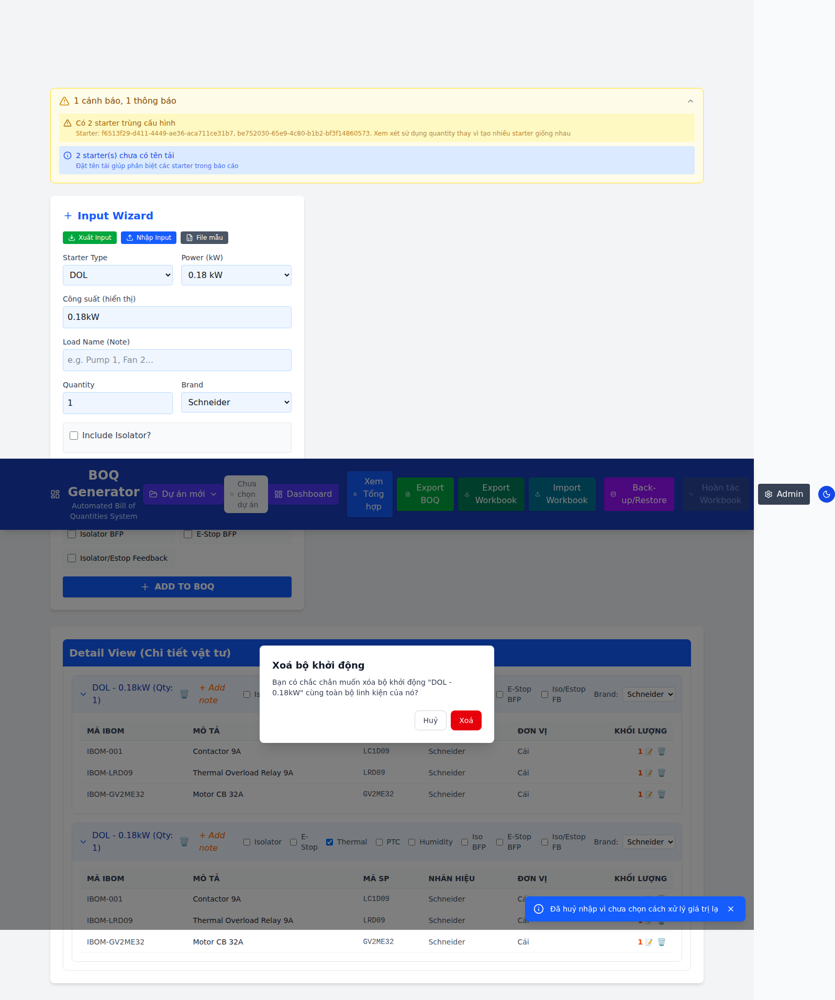

---

## 11. Phụ lục: dữ liệu được lưu ở đâu

App là **SPA client-only**: mọi dữ liệu nằm trong **localStorage của trình duyệt** (không có máy chủ). Các khóa chính:

- `boq_library` — thư viện sản phẩm (Product[]).
- `boq_templates` — template (theo Starter Type → tier → dòng).
- `boq_brands` — danh sách nhãn hiệu.
- `boq_matchkey_meta` — khai báo brand-sensitive / nhóm thiết bị của từng Match Key.
- `boq_projects` — danh sách dự án + dự án đang mở.
- `boq_theme` — giao diện sáng/tối.

**Khuyến nghị an toàn dữ liệu:**
1. **Export Backup** định kỳ (nhất là trước khi Import/Replace/Clear).
2. Trước khi **Thay thế toàn bộ** thư viện/template, luôn Export backup.
3. Dữ liệu chỉ nằm trong trình duyệt của máy này — **xóa dữ liệu trình duyệt sẽ mất** nếu chưa backup. Dùng **Export Workbook / Backup** để chuyển sang máy khác.

---

*Tài liệu này mô tả đúng hành vi bản đã recode (không Common Logic, công suất dạng text, hộp thoại trong app). Ảnh chụp trong `docs/img/`.*
